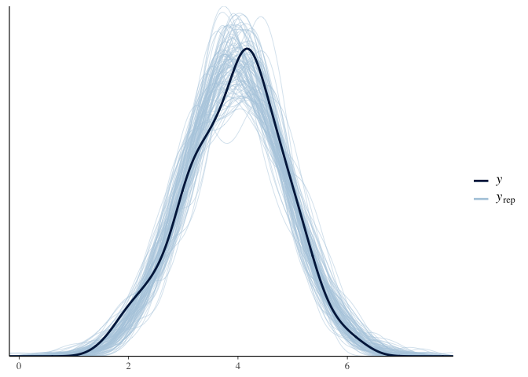
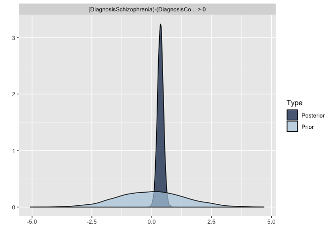
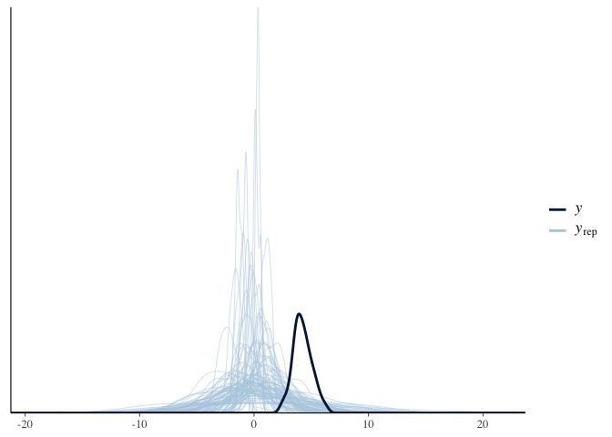
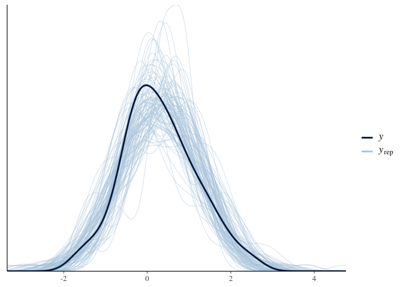
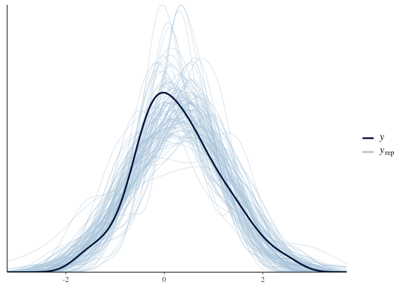
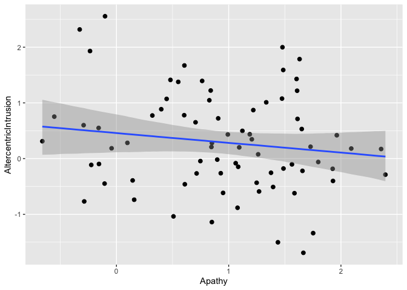
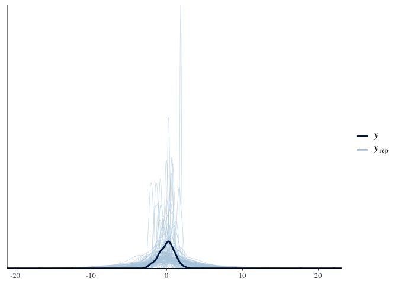
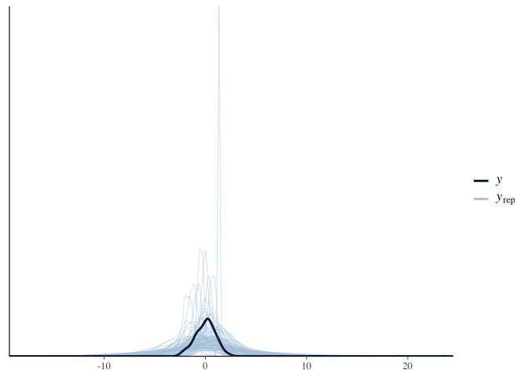
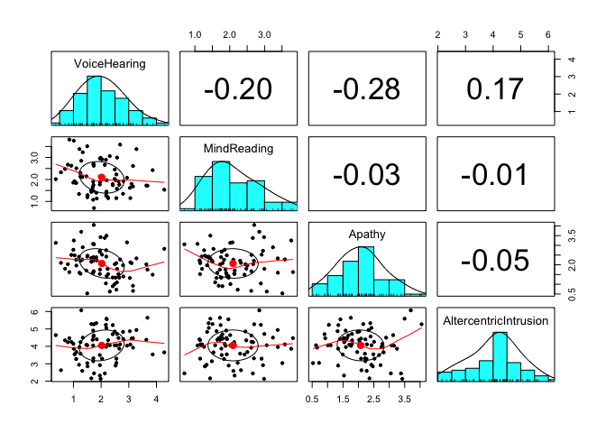

Assignment 3 - Exploring causal inference issues
------------------------------------------------

In this assignment we explore some issues related to multiple
regressions (regressions with more than one predictor), and inferred
(causal) relations between variables. N.B. the data is simulated (to
make sure I know the actual mechanism generating it), but it’s based on
a real study. So bear with a longish introduction to get into the
details of what we are doing and why it is important.

### Altercentric intrusion in schizophrenia

People with schizophrenia often report altered control and distinction
of self-other representations: intrusive thoughts, hearing of voices,
delusions of mind reading, paranoia, etc (a substantial portion of the
psychotic symptoms experienced in schizophrenia). These have been
variously attributed to hypermentalizing (over attribution of mental
states to others), social impairment (over preoccupation with own
thought processes), hyper socialization (inability to inhibit
information from others), etc.

The current study investigates 1) whether schizophrenia is indeed
related to altered control and distinction of self-other
representations, in particular altercentric intrusions (inability to
inhibit social information), and 2) whether these are related to the
relevant psychotic symptoms. N.B. the actual study also investigates
egocentric intrusion, do check the papers below if interested.

The task is a slightly modified version of this:
<a href="https://www.ncbi.nlm.nih.gov/pubmed/20731512" class="uri">https://www.ncbi.nlm.nih.gov/pubmed/20731512</a>
You look at a picture with some dots visible to you, as well as with a
different person with a different set of dots visible to them. The
number of dots you see and that the other sees can be the same
(congruent condition) or not (incongruent condition). You are tasked to
indicate whether a given number (e.g. 3) matches the number of dots you
see (and the dots visible to the other person are irrelevant to the
task).

The tasks investigates altercentric intrusion: will your reaction time
change according to whether the other person is seeing the same amount
of dots as you, or not? The idea is that if you correctly inhibit social
information, your reaction time should not change, as the information
about the other person is not relevant. On the contrary, if you
nevertheless use task irrelevant social information, you’ll be slower at
indicating whether 3 is the right number of dots when the other person
sees a different amount of dots than you (conflicting information). The
bigger the difference between RTs in the congruent and incongruent
condition the bigger the altercentric intrusion effect.

For each participant you have 6 variables: 1) ID, 2)
AltercentricIntrusion (continuous score), 3) Diagnosis (schizophrenia
vs. control), 4) VoiceHearing (severity of voice hearing symptoms,
continuous score of the severity of the symptom as measured by a
clinician), 5) MindReading (severity of delusions of mind reading,
continuous score of the severity of the symptom as measured by a
clinician); 6) Apathy (severity of lack of motivation in taking care of
oneself, from washing to showing up at work, continuous score of the
severity of the symptom as measured by a clinician).

The research questions you have to answer are the following:

First part
----------

Q1.1) Does schizophrenia involved altercentric intrusion? Define model
and priors. Test the implications of your priors (prior predictive
checks) and if needed adjust them. Run the model. Test the quality of
the fitted model (posterior predictive checks). Assess the evidence in
favor of an increased altercentric intrusion in schizophrenia. Report
the model and the results, including plots.

``` r
#1:test h that scz has higher ACI than controls 

pacman::p_load(tidyverse, brms, dplyr)
pacman::p_load(patchwork)

#PREPARE DATA -------------------------------------

#load data
d <- read_csv("Ass3.csv")
```

    ## Parsed with column specification:
    ## cols(
    ##   VoiceHearing = col_double(),
    ##   MindReading = col_double(),
    ##   Apathy = col_double(),
    ##   AltercentricIntrusion = col_double(),
    ##   ID = col_double(),
    ##   Diagnosis = col_double()
    ## )

``` r
#check if continuous 
summary(d)
```

    ##   VoiceHearing      MindReading          Apathy        AltercentricIntrusion
    ##  Min.   :-1.8754   Min.   :-1.4875   Min.   :-1.4747   Min.   :1.494        
    ##  1st Qu.: 0.5295   1st Qu.: 0.4483   1st Qu.: 0.5856   1st Qu.:3.322        
    ##  Median : 1.1920   Median : 1.1987   Median : 1.1123   Median :4.046        
    ##  Mean   : 1.1780   Mean   : 1.1320   Mean   : 1.1911   Mean   :3.952        
    ##  3rd Qu.: 1.8583   3rd Qu.: 1.7438   3rd Qu.: 1.8822   3rd Qu.:4.611        
    ##  Max.   : 3.6905   Max.   : 3.7404   Max.   : 3.5015   Max.   :6.312        
    ##        ID           Diagnosis   
    ##  Min.   :  1.00   Min.   :0.00  
    ##  1st Qu.: 75.75   1st Qu.:0.00  
    ##  Median :150.50   Median :0.00  
    ##  Mean   :150.50   Mean   :0.25  
    ##  3rd Qu.:225.25   3rd Qu.:0.25  
    ##  Max.   :300.00   Max.   :1.00

``` r
#tell data set what 0 and 1 mean 
d$Diagnosis <- plyr::revalue(as.character(d$Diagnosis), 
                             c("0"="Controls", "1"="Schizophrenia"))

#add factors
d <- d %>%
  mutate(
    ID = as.factor(ID),
    Diagnosis = as.factor(Diagnosis)
  )


#DEFINE FORMULA -------------------------------------

#no repeated measures,bf = bayesian formula
AltercentricDiagnosis_f0 <- bf(
  AltercentricIntrusion ~ 1 + Diagnosis
)

#give absolute values for both controls and SCZ
AltercentricDiagnosis_f <- bf(
  AltercentricIntrusion ~ 0 + Diagnosis
)

#PRIORS -------------------------------------

#find out what we can define
get_prior(AltercentricDiagnosis_f0, family = gaussian, d)
```

    ##                 prior     class                   coef group resp dpar nlpar
    ## 1                             b                                             
    ## 2                             b DiagnosisSchizophrenia                      
    ## 3 student_t(3, 4, 10) Intercept                                             
    ## 4 student_t(3, 0, 10)     sigma                                             
    ##   bound
    ## 1      
    ## 2      
    ## 3      
    ## 4

``` r
get_prior(AltercentricDiagnosis_f, family = gaussian, d)
```

    ##                 prior class                   coef group resp dpar nlpar bound
    ## 1                         b                                                   
    ## 2                         b      DiagnosisControls                            
    ## 3                         b DiagnosisSchizophrenia                            
    ## 4 student_t(3, 0, 10) sigma

``` r
#define priors
priorDiagnosis <- c(
  prior(normal(4, 1), class = b), # if only b long tail - to avoid: sigma 
  prior(normal(1, 2), class = sigma)
) 

#test priors
AltercentricDiagnosis_PriorCheck_m <- brm(
  formula = AltercentricDiagnosis_f,
  data = d,
  family = gaussian,
  prior = priorDiagnosis,
  sample_prior = "only"
)
```

    ## Compiling the C++ model

    ## Start sampling

    ## 
    ## SAMPLING FOR MODEL '2e80d7b3a6f60043dae1ffabb00f0844' NOW (CHAIN 1).
    ## Chain 1: 
    ## Chain 1: Gradient evaluation took 2.1e-05 seconds
    ## Chain 1: 1000 transitions using 10 leapfrog steps per transition would take 0.21 seconds.
    ## Chain 1: Adjust your expectations accordingly!
    ## Chain 1: 
    ## Chain 1: 
    ## Chain 1: Iteration:    1 / 2000 [  0%]  (Warmup)
    ## Chain 1: Iteration:  200 / 2000 [ 10%]  (Warmup)
    ## Chain 1: Iteration:  400 / 2000 [ 20%]  (Warmup)
    ## Chain 1: Iteration:  600 / 2000 [ 30%]  (Warmup)
    ## Chain 1: Iteration:  800 / 2000 [ 40%]  (Warmup)
    ## Chain 1: Iteration: 1000 / 2000 [ 50%]  (Warmup)
    ## Chain 1: Iteration: 1001 / 2000 [ 50%]  (Sampling)
    ## Chain 1: Iteration: 1200 / 2000 [ 60%]  (Sampling)
    ## Chain 1: Iteration: 1400 / 2000 [ 70%]  (Sampling)
    ## Chain 1: Iteration: 1600 / 2000 [ 80%]  (Sampling)
    ## Chain 1: Iteration: 1800 / 2000 [ 90%]  (Sampling)
    ## Chain 1: Iteration: 2000 / 2000 [100%]  (Sampling)
    ## Chain 1: 
    ## Chain 1:  Elapsed Time: 0.022872 seconds (Warm-up)
    ## Chain 1:                0.017891 seconds (Sampling)
    ## Chain 1:                0.040763 seconds (Total)
    ## Chain 1: 
    ## 
    ## SAMPLING FOR MODEL '2e80d7b3a6f60043dae1ffabb00f0844' NOW (CHAIN 2).
    ## Chain 2: 
    ## Chain 2: Gradient evaluation took 4e-06 seconds
    ## Chain 2: 1000 transitions using 10 leapfrog steps per transition would take 0.04 seconds.
    ## Chain 2: Adjust your expectations accordingly!
    ## Chain 2: 
    ## Chain 2: 
    ## Chain 2: Iteration:    1 / 2000 [  0%]  (Warmup)
    ## Chain 2: Iteration:  200 / 2000 [ 10%]  (Warmup)
    ## Chain 2: Iteration:  400 / 2000 [ 20%]  (Warmup)
    ## Chain 2: Iteration:  600 / 2000 [ 30%]  (Warmup)
    ## Chain 2: Iteration:  800 / 2000 [ 40%]  (Warmup)
    ## Chain 2: Iteration: 1000 / 2000 [ 50%]  (Warmup)
    ## Chain 2: Iteration: 1001 / 2000 [ 50%]  (Sampling)
    ## Chain 2: Iteration: 1200 / 2000 [ 60%]  (Sampling)
    ## Chain 2: Iteration: 1400 / 2000 [ 70%]  (Sampling)
    ## Chain 2: Iteration: 1600 / 2000 [ 80%]  (Sampling)
    ## Chain 2: Iteration: 1800 / 2000 [ 90%]  (Sampling)
    ## Chain 2: Iteration: 2000 / 2000 [100%]  (Sampling)
    ## Chain 2: 
    ## Chain 2:  Elapsed Time: 0.024879 seconds (Warm-up)
    ## Chain 2:                0.022298 seconds (Sampling)
    ## Chain 2:                0.047177 seconds (Total)
    ## Chain 2: 
    ## 
    ## SAMPLING FOR MODEL '2e80d7b3a6f60043dae1ffabb00f0844' NOW (CHAIN 3).
    ## Chain 3: 
    ## Chain 3: Gradient evaluation took 4e-06 seconds
    ## Chain 3: 1000 transitions using 10 leapfrog steps per transition would take 0.04 seconds.
    ## Chain 3: Adjust your expectations accordingly!
    ## Chain 3: 
    ## Chain 3: 
    ## Chain 3: Iteration:    1 / 2000 [  0%]  (Warmup)
    ## Chain 3: Iteration:  200 / 2000 [ 10%]  (Warmup)
    ## Chain 3: Iteration:  400 / 2000 [ 20%]  (Warmup)
    ## Chain 3: Iteration:  600 / 2000 [ 30%]  (Warmup)
    ## Chain 3: Iteration:  800 / 2000 [ 40%]  (Warmup)
    ## Chain 3: Iteration: 1000 / 2000 [ 50%]  (Warmup)
    ## Chain 3: Iteration: 1001 / 2000 [ 50%]  (Sampling)
    ## Chain 3: Iteration: 1200 / 2000 [ 60%]  (Sampling)
    ## Chain 3: Iteration: 1400 / 2000 [ 70%]  (Sampling)
    ## Chain 3: Iteration: 1600 / 2000 [ 80%]  (Sampling)
    ## Chain 3: Iteration: 1800 / 2000 [ 90%]  (Sampling)
    ## Chain 3: Iteration: 2000 / 2000 [100%]  (Sampling)
    ## Chain 3: 
    ## Chain 3:  Elapsed Time: 0.02151 seconds (Warm-up)
    ## Chain 3:                0.024112 seconds (Sampling)
    ## Chain 3:                0.045622 seconds (Total)
    ## Chain 3: 
    ## 
    ## SAMPLING FOR MODEL '2e80d7b3a6f60043dae1ffabb00f0844' NOW (CHAIN 4).
    ## Chain 4: 
    ## Chain 4: Gradient evaluation took 6e-06 seconds
    ## Chain 4: 1000 transitions using 10 leapfrog steps per transition would take 0.06 seconds.
    ## Chain 4: Adjust your expectations accordingly!
    ## Chain 4: 
    ## Chain 4: 
    ## Chain 4: Iteration:    1 / 2000 [  0%]  (Warmup)
    ## Chain 4: Iteration:  200 / 2000 [ 10%]  (Warmup)
    ## Chain 4: Iteration:  400 / 2000 [ 20%]  (Warmup)
    ## Chain 4: Iteration:  600 / 2000 [ 30%]  (Warmup)
    ## Chain 4: Iteration:  800 / 2000 [ 40%]  (Warmup)
    ## Chain 4: Iteration: 1000 / 2000 [ 50%]  (Warmup)
    ## Chain 4: Iteration: 1001 / 2000 [ 50%]  (Sampling)
    ## Chain 4: Iteration: 1200 / 2000 [ 60%]  (Sampling)
    ## Chain 4: Iteration: 1400 / 2000 [ 70%]  (Sampling)
    ## Chain 4: Iteration: 1600 / 2000 [ 80%]  (Sampling)
    ## Chain 4: Iteration: 1800 / 2000 [ 90%]  (Sampling)
    ## Chain 4: Iteration: 2000 / 2000 [100%]  (Sampling)
    ## Chain 4: 
    ## Chain 4:  Elapsed Time: 0.025333 seconds (Warm-up)
    ## Chain 4:                0.02113 seconds (Sampling)
    ## Chain 4:                0.046463 seconds (Total)
    ## Chain 4:

``` r
#prior predictive checks
pp_check(AltercentricDiagnosis_PriorCheck_m, nsamples = 100)
```


``` r
#RUN MODEL -------------------------------------
AltercentricDiagnosis_m <- brm(
  formula = AltercentricDiagnosis_f,
  data = d,
  family = gaussian,
  prior = priorDiagnosis,
  sample_prior = T
)
```

    ## Compiling the C++ model
    ## Start sampling

    ## 
    ## SAMPLING FOR MODEL '501c4de236ade3d60a007a655a601366' NOW (CHAIN 1).
    ## Chain 1: 
    ## Chain 1: Gradient evaluation took 2.1e-05 seconds
    ## Chain 1: 1000 transitions using 10 leapfrog steps per transition would take 0.21 seconds.
    ## Chain 1: Adjust your expectations accordingly!
    ## Chain 1: 
    ## Chain 1: 
    ## Chain 1: Iteration:    1 / 2000 [  0%]  (Warmup)
    ## Chain 1: Iteration:  200 / 2000 [ 10%]  (Warmup)
    ## Chain 1: Iteration:  400 / 2000 [ 20%]  (Warmup)
    ## Chain 1: Iteration:  600 / 2000 [ 30%]  (Warmup)
    ## Chain 1: Iteration:  800 / 2000 [ 40%]  (Warmup)
    ## Chain 1: Iteration: 1000 / 2000 [ 50%]  (Warmup)
    ## Chain 1: Iteration: 1001 / 2000 [ 50%]  (Sampling)
    ## Chain 1: Iteration: 1200 / 2000 [ 60%]  (Sampling)
    ## Chain 1: Iteration: 1400 / 2000 [ 70%]  (Sampling)
    ## Chain 1: Iteration: 1600 / 2000 [ 80%]  (Sampling)
    ## Chain 1: Iteration: 1800 / 2000 [ 90%]  (Sampling)
    ## Chain 1: Iteration: 2000 / 2000 [100%]  (Sampling)
    ## Chain 1: 
    ## Chain 1:  Elapsed Time: 0.026226 seconds (Warm-up)
    ## Chain 1:                0.023696 seconds (Sampling)
    ## Chain 1:                0.049922 seconds (Total)
    ## Chain 1: 
    ## 
    ## SAMPLING FOR MODEL '501c4de236ade3d60a007a655a601366' NOW (CHAIN 2).
    ## Chain 2: 
    ## Chain 2: Gradient evaluation took 1.6e-05 seconds
    ## Chain 2: 1000 transitions using 10 leapfrog steps per transition would take 0.16 seconds.
    ## Chain 2: Adjust your expectations accordingly!
    ## Chain 2: 
    ## Chain 2: 
    ## Chain 2: Iteration:    1 / 2000 [  0%]  (Warmup)
    ## Chain 2: Iteration:  200 / 2000 [ 10%]  (Warmup)
    ## Chain 2: Iteration:  400 / 2000 [ 20%]  (Warmup)
    ## Chain 2: Iteration:  600 / 2000 [ 30%]  (Warmup)
    ## Chain 2: Iteration:  800 / 2000 [ 40%]  (Warmup)
    ## Chain 2: Iteration: 1000 / 2000 [ 50%]  (Warmup)
    ## Chain 2: Iteration: 1001 / 2000 [ 50%]  (Sampling)
    ## Chain 2: Iteration: 1200 / 2000 [ 60%]  (Sampling)
    ## Chain 2: Iteration: 1400 / 2000 [ 70%]  (Sampling)
    ## Chain 2: Iteration: 1600 / 2000 [ 80%]  (Sampling)
    ## Chain 2: Iteration: 1800 / 2000 [ 90%]  (Sampling)
    ## Chain 2: Iteration: 2000 / 2000 [100%]  (Sampling)
    ## Chain 2: 
    ## Chain 2:  Elapsed Time: 0.030366 seconds (Warm-up)
    ## Chain 2:                0.027353 seconds (Sampling)
    ## Chain 2:                0.057719 seconds (Total)
    ## Chain 2: 
    ## 
    ## SAMPLING FOR MODEL '501c4de236ade3d60a007a655a601366' NOW (CHAIN 3).
    ## Chain 3: 
    ## Chain 3: Gradient evaluation took 1.1e-05 seconds
    ## Chain 3: 1000 transitions using 10 leapfrog steps per transition would take 0.11 seconds.
    ## Chain 3: Adjust your expectations accordingly!
    ## Chain 3: 
    ## Chain 3: 
    ## Chain 3: Iteration:    1 / 2000 [  0%]  (Warmup)
    ## Chain 3: Iteration:  200 / 2000 [ 10%]  (Warmup)
    ## Chain 3: Iteration:  400 / 2000 [ 20%]  (Warmup)
    ## Chain 3: Iteration:  600 / 2000 [ 30%]  (Warmup)
    ## Chain 3: Iteration:  800 / 2000 [ 40%]  (Warmup)
    ## Chain 3: Iteration: 1000 / 2000 [ 50%]  (Warmup)
    ## Chain 3: Iteration: 1001 / 2000 [ 50%]  (Sampling)
    ## Chain 3: Iteration: 1200 / 2000 [ 60%]  (Sampling)
    ## Chain 3: Iteration: 1400 / 2000 [ 70%]  (Sampling)
    ## Chain 3: Iteration: 1600 / 2000 [ 80%]  (Sampling)
    ## Chain 3: Iteration: 1800 / 2000 [ 90%]  (Sampling)
    ## Chain 3: Iteration: 2000 / 2000 [100%]  (Sampling)
    ## Chain 3: 
    ## Chain 3:  Elapsed Time: 0.027302 seconds (Warm-up)
    ## Chain 3:                0.026809 seconds (Sampling)
    ## Chain 3:                0.054111 seconds (Total)
    ## Chain 3: 
    ## 
    ## SAMPLING FOR MODEL '501c4de236ade3d60a007a655a601366' NOW (CHAIN 4).
    ## Chain 4: 
    ## Chain 4: Gradient evaluation took 1.2e-05 seconds
    ## Chain 4: 1000 transitions using 10 leapfrog steps per transition would take 0.12 seconds.
    ## Chain 4: Adjust your expectations accordingly!
    ## Chain 4: 
    ## Chain 4: 
    ## Chain 4: Iteration:    1 / 2000 [  0%]  (Warmup)
    ## Chain 4: Iteration:  200 / 2000 [ 10%]  (Warmup)
    ## Chain 4: Iteration:  400 / 2000 [ 20%]  (Warmup)
    ## Chain 4: Iteration:  600 / 2000 [ 30%]  (Warmup)
    ## Chain 4: Iteration:  800 / 2000 [ 40%]  (Warmup)
    ## Chain 4: Iteration: 1000 / 2000 [ 50%]  (Warmup)
    ## Chain 4: Iteration: 1001 / 2000 [ 50%]  (Sampling)
    ## Chain 4: Iteration: 1200 / 2000 [ 60%]  (Sampling)
    ## Chain 4: Iteration: 1400 / 2000 [ 70%]  (Sampling)
    ## Chain 4: Iteration: 1600 / 2000 [ 80%]  (Sampling)
    ## Chain 4: Iteration: 1800 / 2000 [ 90%]  (Sampling)
    ## Chain 4: Iteration: 2000 / 2000 [100%]  (Sampling)
    ## Chain 4: 
    ## Chain 4:  Elapsed Time: 0.029562 seconds (Warm-up)
    ## Chain 4:                0.029762 seconds (Sampling)
    ## Chain 4:                0.059324 seconds (Total)
    ## Chain 4:

``` r
#posterior predictive check
pp_check(AltercentricDiagnosis_m, nsamples = 100)
```



``` r
#MODEL OUTPUT + PLOTS -------------------------------------

#model output, check warnings
AltercentricDiagnosis_m
```

    ##  Family: gaussian 
    ##   Links: mu = identity; sigma = identity 
    ## Formula: AltercentricIntrusion ~ 0 + Diagnosis 
    ##    Data: d (Number of observations: 300) 
    ## Samples: 4 chains, each with iter = 2000; warmup = 1000; thin = 1;
    ##          total post-warmup samples = 4000
    ## 
    ## Population-Level Effects: 
    ##                        Estimate Est.Error l-95% CI u-95% CI Rhat Bulk_ESS
    ## DiagnosisControls          3.86      0.06     3.74     3.98 1.00     4228
    ## DiagnosisSchizophrenia     4.22      0.11     4.02     4.43 1.00     4029
    ##                        Tail_ESS
    ## DiagnosisControls          2957
    ## DiagnosisSchizophrenia     2917
    ## 
    ## Family Specific Parameters: 
    ##       Estimate Est.Error l-95% CI u-95% CI Rhat Bulk_ESS Tail_ESS
    ## sigma     0.91      0.04     0.85     0.99 1.00     3504     3138
    ## 
    ## Samples were drawn using sampling(NUTS). For each parameter, Bulk_ESS
    ## and Tail_ESS are effective sample size measures, and Rhat is the potential
    ## scale reduction factor on split chains (at convergence, Rhat = 1).

``` r
summary(AltercentricDiagnosis_m)
```

    ##  Family: gaussian 
    ##   Links: mu = identity; sigma = identity 
    ## Formula: AltercentricIntrusion ~ 0 + Diagnosis 
    ##    Data: d (Number of observations: 300) 
    ## Samples: 4 chains, each with iter = 2000; warmup = 1000; thin = 1;
    ##          total post-warmup samples = 4000
    ## 
    ## Population-Level Effects: 
    ##                        Estimate Est.Error l-95% CI u-95% CI Rhat Bulk_ESS
    ## DiagnosisControls          3.86      0.06     3.74     3.98 1.00     4228
    ## DiagnosisSchizophrenia     4.22      0.11     4.02     4.43 1.00     4029
    ##                        Tail_ESS
    ## DiagnosisControls          2957
    ## DiagnosisSchizophrenia     2917
    ## 
    ## Family Specific Parameters: 
    ##       Estimate Est.Error l-95% CI u-95% CI Rhat Bulk_ESS Tail_ESS
    ## sigma     0.91      0.04     0.85     0.99 1.00     3504     3138
    ## 
    ## Samples were drawn using sampling(NUTS). For each parameter, Bulk_ESS
    ## and Tail_ESS are effective sample size measures, and Rhat is the potential
    ## scale reduction factor on split chains (at convergence, Rhat = 1).

``` r
hypothesis(AltercentricDiagnosis_m,
           "DiagnosisSchizophrenia > 0")
```

    ## Hypothesis Tests for class b:
    ##                 Hypothesis Estimate Est.Error CI.Lower CI.Upper Evid.Ratio
    ## 1 (DiagnosisSchizop... > 0     4.22      0.11     4.05      4.4        Inf
    ##   Post.Prob Star
    ## 1         1    *
    ## ---
    ## 'CI': 90%-CI for one-sided and 95%-CI for two-sided hypotheses.
    ## '*': For one-sided hypotheses, the posterior probability exceeds 95%;
    ## for two-sided hypotheses, the value tested against lies outside the 95%-CI.
    ## Posterior probabilities of point hypotheses assume equal prior probabilities.

``` r
hypothesis(AltercentricDiagnosis_m,
           "DiagnosisControls > 0")
```

    ## Hypothesis Tests for class b:
    ##                Hypothesis Estimate Est.Error CI.Lower CI.Upper Evid.Ratio
    ## 1 (DiagnosisControls) > 0     3.86      0.06     3.76     3.96        Inf
    ##   Post.Prob Star
    ## 1         1    *
    ## ---
    ## 'CI': 90%-CI for one-sided and 95%-CI for two-sided hypotheses.
    ## '*': For one-sided hypotheses, the posterior probability exceeds 95%;
    ## for two-sided hypotheses, the value tested against lies outside the 95%-CI.
    ## Posterior probabilities of point hypotheses assume equal prior probabilities.

``` r
#hypotheis testing, updating check
hypothesis(AltercentricDiagnosis_m,
           "DiagnosisSchizophrenia > DiagnosisControls")
```

    ## Hypothesis Tests for class b:
    ##                 Hypothesis Estimate Est.Error CI.Lower CI.Upper Evid.Ratio
    ## 1 (DiagnosisSchizop... > 0     0.36      0.12     0.16     0.56        499
    ##   Post.Prob Star
    ## 1         1    *
    ## ---
    ## 'CI': 90%-CI for one-sided and 95%-CI for two-sided hypotheses.
    ## '*': For one-sided hypotheses, the posterior probability exceeds 95%;
    ## for two-sided hypotheses, the value tested against lies outside the 95%-CI.
    ## Posterior probabilities of point hypotheses assume equal prior probabilities.

``` r
plot(hypothesis(AltercentricDiagnosis_m,
           "DiagnosisSchizophrenia > DiagnosisControls"))
```



``` r
hypothesis(AltercentricDiagnosis_m,
           "DiagnosisSchizophrenia > DiagnosisControls")
```

    ## Hypothesis Tests for class b:
    ##                 Hypothesis Estimate Est.Error CI.Lower CI.Upper Evid.Ratio
    ## 1 (DiagnosisSchizop... > 0     0.36      0.12     0.16     0.56        499
    ##   Post.Prob Star
    ## 1         1    *
    ## ---
    ## 'CI': 90%-CI for one-sided and 95%-CI for two-sided hypotheses.
    ## '*': For one-sided hypotheses, the posterior probability exceeds 95%;
    ## for two-sided hypotheses, the value tested against lies outside the 95%-CI.
    ## Posterior probabilities of point hypotheses assume equal prior probabilities.

``` r
#evidence ratio: how many of the samples are compatible with our hypotheiss, out of 4000 samples (here) - over evidence 

#plot effect
conditional_effects(AltercentricDiagnosis_m)
```


``` r
plot(conditional_effects(AltercentricDiagnosis_m), points=T)
```


The model indicates a credible difference in altercentric intrusion in
the two groups supporting our hypothesis (b = 0.36, CIs = 0.16, 0.57, ER
= 1332). Controls showed on average an altercentric intrusion effect of
3.86 (CIs 3.74, 3.98), and schizophrenia of 4.22 (CIs = 4.01, 4.43).
\[Add plot of the effects\]

SI
==

The model had no divergences, a Rhat of 1, and Effective Sample Sizes
above 2000 for both Bulk and Tail. \[Add prior and posterior checks
plots; add updating check plot\]

Q1.2) Is altercentric intrusion related to specific symptoms *in the
patients*? Identify which of the symptoms could be relevant. Should you
include more than one symptom? Build models, priors, predictive checks.
Assess the evidence and report models and results, including plots.
Discuss whether the results make sense.

``` r
#if there is a true difference in AIC then it might be true that some of the symptoms might be related to the confusion of representation of self and other

#PREPARE DATA -------------------------------------

#scale - if we don't there will be some correlations of intercept and slope 
d <- d %>%
  mutate(
    AltercentricIntrusion_truescale = scale(AltercentricIntrusion),
    VoiceHearing = scale(VoiceHearing),
    MindReading = scale(MindReading),
    Apathy = scale(Apathy)
  )

d <- d %>%
  mutate(
    AltercentricIntrusion_scale = (AltercentricIntrusion - mean(AltercentricIntrusion)) / sd (AltercentricIntrusion))

#subset with only schizophrenia 
scz <- subset(d, Diagnosis == "Schizophrenia")
summary(scz)
```

    ##    VoiceHearing.V1       MindReading.V1         Apathy.V1      
    ##  Min.   :-0.4631064   Min.   :-1.5752946   Min.   :-0.6603158  
    ##  1st Qu.: 0.5537819   1st Qu.: 0.0749862   1st Qu.: 0.4945482  
    ##  Median : 0.9644676   Median : 0.6298221   Median : 0.9923623  
    ##  Mean   : 0.9876248   Mean   : 0.6923401   Mean   : 0.9391452  
    ##  3rd Qu.: 1.5582076   3rd Qu.: 1.3848345   3rd Qu.: 1.4869851  
    ##  Max.   : 2.4340907   Max.   : 2.6852970   Max.   : 2.3962430  
    ##                                                                
    ##  AltercentricIntrusion       ID             Diagnosis 
    ##  Min.   :2.390         3      : 1   Controls     : 0  
    ##  1st Qu.:3.708         4      : 1   Schizophrenia:75  
    ##  Median :4.145         5      : 1                     
    ##  Mean   :4.227         16     : 1                     
    ##  3rd Qu.:4.714         18     : 1                     
    ##  Max.   :6.312         23     : 1                     
    ##                        (Other):69                     
    ##  AltercentricIntrusion_truescale.V1 AltercentricIntrusion_scale
    ##  Min.   :-1.6915010                 Min.   :-1.6915            
    ##  1st Qu.:-0.2643837                 1st Qu.:-0.2644            
    ##  Median : 0.2084990                 Median : 0.2085            
    ##  Mean   : 0.2973705                 Mean   : 0.2974            
    ##  3rd Qu.: 0.8249317                 3rd Qu.: 0.8249            
    ##  Max.   : 2.5559055                 Max.   : 2.5559            
    ## 

``` r
sd(scz$AltercentricIntrusion)
```

    ## [1] 0.8168041

``` r
#DEFINE FORMULA -------------------------------------
#voice hearing
voicehearing_f <- bf(
  AltercentricIntrusion ~ 1 + VoiceHearing
)

#mind reading
mindreading_f <- bf(
  AltercentricIntrusion ~ 1 + MindReading
)

#apathy
apathy_f <- bf(
  AltercentricIntrusion ~ 1 + Apathy
)

#voice + mind 
voicemind_f <- bf(
  AltercentricIntrusion ~ 1 + VoiceHearing + MindReading
)

#voice + mind + apathy
all_f <- bf(
  AltercentricIntrusion ~ 1 + VoiceHearing + MindReading + Apathy
)

#PRIORS -------------------------------------
#get priors
get_prior(voicehearing_f, family = gaussian, scz)
```

    ##                 prior     class         coef group resp dpar nlpar bound
    ## 1                             b                                         
    ## 2                             b VoiceHearing                            
    ## 3 student_t(3, 4, 10) Intercept                                         
    ## 4 student_t(3, 0, 10)     sigma

``` r
get_prior(mindreading_f, family = gaussian, scz)
```

    ##                 prior     class        coef group resp dpar nlpar bound
    ## 1                             b                                        
    ## 2                             b MindReading                            
    ## 3 student_t(3, 4, 10) Intercept                                        
    ## 4 student_t(3, 0, 10)     sigma

``` r
get_prior(apathy_f, family = gaussian, scz)
```

    ##                 prior     class   coef group resp dpar nlpar bound
    ## 1                             b                                   
    ## 2                             b Apathy                            
    ## 3 student_t(3, 4, 10) Intercept                                   
    ## 4 student_t(3, 0, 10)     sigma

``` r
get_prior(voicemind_f, family = gaussian, scz)
```

    ##                 prior     class         coef group resp dpar nlpar bound
    ## 1                             b                                         
    ## 2                             b  MindReading                            
    ## 3                             b VoiceHearing                            
    ## 4 student_t(3, 4, 10) Intercept                                         
    ## 5 student_t(3, 0, 10)     sigma

``` r
get_prior(all_f, family = gaussian, scz)
```

    ##                 prior     class         coef group resp dpar nlpar bound
    ## 1                             b                                         
    ## 2                             b       Apathy                            
    ## 3                             b  MindReading                            
    ## 4                             b VoiceHearing                            
    ## 5 student_t(3, 4, 10) Intercept                                         
    ## 6 student_t(3, 0, 10)     sigma

``` r
#define priors
prior <- c(
  prior(normal(0,.3), class = b), #make 1 smaller? 
  prior(normal(1,2), class = sigma),
  prior(normal(0,1), class = Intercept)) #0 becasue we scaled things

#test prios
voicehearing_PriorCheck_m <- brm(
  formula = voicehearing_f,
  data = scz,
  family = gaussian,
  prior = prior,
  sample_prior = "only"
)
```

    ## Compiling the C++ model

    ## Start sampling

    ## 
    ## SAMPLING FOR MODEL '0dc13a45afab2f57b619df1b1973a90b' NOW (CHAIN 1).
    ## Chain 1: 
    ## Chain 1: Gradient evaluation took 1.7e-05 seconds
    ## Chain 1: 1000 transitions using 10 leapfrog steps per transition would take 0.17 seconds.
    ## Chain 1: Adjust your expectations accordingly!
    ## Chain 1: 
    ## Chain 1: 
    ## Chain 1: Iteration:    1 / 2000 [  0%]  (Warmup)
    ## Chain 1: Iteration:  200 / 2000 [ 10%]  (Warmup)
    ## Chain 1: Iteration:  400 / 2000 [ 20%]  (Warmup)
    ## Chain 1: Iteration:  600 / 2000 [ 30%]  (Warmup)
    ## Chain 1: Iteration:  800 / 2000 [ 40%]  (Warmup)
    ## Chain 1: Iteration: 1000 / 2000 [ 50%]  (Warmup)
    ## Chain 1: Iteration: 1001 / 2000 [ 50%]  (Sampling)
    ## Chain 1: Iteration: 1200 / 2000 [ 60%]  (Sampling)
    ## Chain 1: Iteration: 1400 / 2000 [ 70%]  (Sampling)
    ## Chain 1: Iteration: 1600 / 2000 [ 80%]  (Sampling)
    ## Chain 1: Iteration: 1800 / 2000 [ 90%]  (Sampling)
    ## Chain 1: Iteration: 2000 / 2000 [100%]  (Sampling)
    ## Chain 1: 
    ## Chain 1:  Elapsed Time: 0.028281 seconds (Warm-up)
    ## Chain 1:                0.02129 seconds (Sampling)
    ## Chain 1:                0.049571 seconds (Total)
    ## Chain 1: 
    ## 
    ## SAMPLING FOR MODEL '0dc13a45afab2f57b619df1b1973a90b' NOW (CHAIN 2).
    ## Chain 2: 
    ## Chain 2: Gradient evaluation took 4e-06 seconds
    ## Chain 2: 1000 transitions using 10 leapfrog steps per transition would take 0.04 seconds.
    ## Chain 2: Adjust your expectations accordingly!
    ## Chain 2: 
    ## Chain 2: 
    ## Chain 2: Iteration:    1 / 2000 [  0%]  (Warmup)
    ## Chain 2: Iteration:  200 / 2000 [ 10%]  (Warmup)
    ## Chain 2: Iteration:  400 / 2000 [ 20%]  (Warmup)
    ## Chain 2: Iteration:  600 / 2000 [ 30%]  (Warmup)
    ## Chain 2: Iteration:  800 / 2000 [ 40%]  (Warmup)
    ## Chain 2: Iteration: 1000 / 2000 [ 50%]  (Warmup)
    ## Chain 2: Iteration: 1001 / 2000 [ 50%]  (Sampling)
    ## Chain 2: Iteration: 1200 / 2000 [ 60%]  (Sampling)
    ## Chain 2: Iteration: 1400 / 2000 [ 70%]  (Sampling)
    ## Chain 2: Iteration: 1600 / 2000 [ 80%]  (Sampling)
    ## Chain 2: Iteration: 1800 / 2000 [ 90%]  (Sampling)
    ## Chain 2: Iteration: 2000 / 2000 [100%]  (Sampling)
    ## Chain 2: 
    ## Chain 2:  Elapsed Time: 0.026209 seconds (Warm-up)
    ## Chain 2:                0.020797 seconds (Sampling)
    ## Chain 2:                0.047006 seconds (Total)
    ## Chain 2: 
    ## 
    ## SAMPLING FOR MODEL '0dc13a45afab2f57b619df1b1973a90b' NOW (CHAIN 3).
    ## Chain 3: 
    ## Chain 3: Gradient evaluation took 5e-06 seconds
    ## Chain 3: 1000 transitions using 10 leapfrog steps per transition would take 0.05 seconds.
    ## Chain 3: Adjust your expectations accordingly!
    ## Chain 3: 
    ## Chain 3: 
    ## Chain 3: Iteration:    1 / 2000 [  0%]  (Warmup)
    ## Chain 3: Iteration:  200 / 2000 [ 10%]  (Warmup)
    ## Chain 3: Iteration:  400 / 2000 [ 20%]  (Warmup)
    ## Chain 3: Iteration:  600 / 2000 [ 30%]  (Warmup)
    ## Chain 3: Iteration:  800 / 2000 [ 40%]  (Warmup)
    ## Chain 3: Iteration: 1000 / 2000 [ 50%]  (Warmup)
    ## Chain 3: Iteration: 1001 / 2000 [ 50%]  (Sampling)
    ## Chain 3: Iteration: 1200 / 2000 [ 60%]  (Sampling)
    ## Chain 3: Iteration: 1400 / 2000 [ 70%]  (Sampling)
    ## Chain 3: Iteration: 1600 / 2000 [ 80%]  (Sampling)
    ## Chain 3: Iteration: 1800 / 2000 [ 90%]  (Sampling)
    ## Chain 3: Iteration: 2000 / 2000 [100%]  (Sampling)
    ## Chain 3: 
    ## Chain 3:  Elapsed Time: 0.026016 seconds (Warm-up)
    ## Chain 3:                0.021611 seconds (Sampling)
    ## Chain 3:                0.047627 seconds (Total)
    ## Chain 3: 
    ## 
    ## SAMPLING FOR MODEL '0dc13a45afab2f57b619df1b1973a90b' NOW (CHAIN 4).
    ## Chain 4: 
    ## Chain 4: Gradient evaluation took 4e-06 seconds
    ## Chain 4: 1000 transitions using 10 leapfrog steps per transition would take 0.04 seconds.
    ## Chain 4: Adjust your expectations accordingly!
    ## Chain 4: 
    ## Chain 4: 
    ## Chain 4: Iteration:    1 / 2000 [  0%]  (Warmup)
    ## Chain 4: Iteration:  200 / 2000 [ 10%]  (Warmup)
    ## Chain 4: Iteration:  400 / 2000 [ 20%]  (Warmup)
    ## Chain 4: Iteration:  600 / 2000 [ 30%]  (Warmup)
    ## Chain 4: Iteration:  800 / 2000 [ 40%]  (Warmup)
    ## Chain 4: Iteration: 1000 / 2000 [ 50%]  (Warmup)
    ## Chain 4: Iteration: 1001 / 2000 [ 50%]  (Sampling)
    ## Chain 4: Iteration: 1200 / 2000 [ 60%]  (Sampling)
    ## Chain 4: Iteration: 1400 / 2000 [ 70%]  (Sampling)
    ## Chain 4: Iteration: 1600 / 2000 [ 80%]  (Sampling)
    ## Chain 4: Iteration: 1800 / 2000 [ 90%]  (Sampling)
    ## Chain 4: Iteration: 2000 / 2000 [100%]  (Sampling)
    ## Chain 4: 
    ## Chain 4:  Elapsed Time: 0.030766 seconds (Warm-up)
    ## Chain 4:                0.024103 seconds (Sampling)
    ## Chain 4:                0.054869 seconds (Total)
    ## Chain 4:

``` r
#prior checks
mindreading_PriorCheck_m <- brm(
  formula = mindreading_f,
  data = scz,
  family = gaussian,
  prior = prior,
  sample_prior = "only"
)
```

    ## Compiling the C++ model

    ## recompiling to avoid crashing R session

    ## Start sampling

    ## 
    ## SAMPLING FOR MODEL '0dc13a45afab2f57b619df1b1973a90b' NOW (CHAIN 1).
    ## Chain 1: 
    ## Chain 1: Gradient evaluation took 2.1e-05 seconds
    ## Chain 1: 1000 transitions using 10 leapfrog steps per transition would take 0.21 seconds.
    ## Chain 1: Adjust your expectations accordingly!
    ## Chain 1: 
    ## Chain 1: 
    ## Chain 1: Iteration:    1 / 2000 [  0%]  (Warmup)
    ## Chain 1: Iteration:  200 / 2000 [ 10%]  (Warmup)
    ## Chain 1: Iteration:  400 / 2000 [ 20%]  (Warmup)
    ## Chain 1: Iteration:  600 / 2000 [ 30%]  (Warmup)
    ## Chain 1: Iteration:  800 / 2000 [ 40%]  (Warmup)
    ## Chain 1: Iteration: 1000 / 2000 [ 50%]  (Warmup)
    ## Chain 1: Iteration: 1001 / 2000 [ 50%]  (Sampling)
    ## Chain 1: Iteration: 1200 / 2000 [ 60%]  (Sampling)
    ## Chain 1: Iteration: 1400 / 2000 [ 70%]  (Sampling)
    ## Chain 1: Iteration: 1600 / 2000 [ 80%]  (Sampling)
    ## Chain 1: Iteration: 1800 / 2000 [ 90%]  (Sampling)
    ## Chain 1: Iteration: 2000 / 2000 [100%]  (Sampling)
    ## Chain 1: 
    ## Chain 1:  Elapsed Time: 0.024229 seconds (Warm-up)
    ## Chain 1:                0.019752 seconds (Sampling)
    ## Chain 1:                0.043981 seconds (Total)
    ## Chain 1: 
    ## 
    ## SAMPLING FOR MODEL '0dc13a45afab2f57b619df1b1973a90b' NOW (CHAIN 2).
    ## Chain 2: 
    ## Chain 2: Gradient evaluation took 4e-06 seconds
    ## Chain 2: 1000 transitions using 10 leapfrog steps per transition would take 0.04 seconds.
    ## Chain 2: Adjust your expectations accordingly!
    ## Chain 2: 
    ## Chain 2: 
    ## Chain 2: Iteration:    1 / 2000 [  0%]  (Warmup)
    ## Chain 2: Iteration:  200 / 2000 [ 10%]  (Warmup)
    ## Chain 2: Iteration:  400 / 2000 [ 20%]  (Warmup)
    ## Chain 2: Iteration:  600 / 2000 [ 30%]  (Warmup)
    ## Chain 2: Iteration:  800 / 2000 [ 40%]  (Warmup)
    ## Chain 2: Iteration: 1000 / 2000 [ 50%]  (Warmup)
    ## Chain 2: Iteration: 1001 / 2000 [ 50%]  (Sampling)
    ## Chain 2: Iteration: 1200 / 2000 [ 60%]  (Sampling)
    ## Chain 2: Iteration: 1400 / 2000 [ 70%]  (Sampling)
    ## Chain 2: Iteration: 1600 / 2000 [ 80%]  (Sampling)
    ## Chain 2: Iteration: 1800 / 2000 [ 90%]  (Sampling)
    ## Chain 2: Iteration: 2000 / 2000 [100%]  (Sampling)
    ## Chain 2: 
    ## Chain 2:  Elapsed Time: 0.02212 seconds (Warm-up)
    ## Chain 2:                0.01883 seconds (Sampling)
    ## Chain 2:                0.04095 seconds (Total)
    ## Chain 2: 
    ## 
    ## SAMPLING FOR MODEL '0dc13a45afab2f57b619df1b1973a90b' NOW (CHAIN 3).
    ## Chain 3: 
    ## Chain 3: Gradient evaluation took 7e-06 seconds
    ## Chain 3: 1000 transitions using 10 leapfrog steps per transition would take 0.07 seconds.
    ## Chain 3: Adjust your expectations accordingly!
    ## Chain 3: 
    ## Chain 3: 
    ## Chain 3: Iteration:    1 / 2000 [  0%]  (Warmup)
    ## Chain 3: Iteration:  200 / 2000 [ 10%]  (Warmup)
    ## Chain 3: Iteration:  400 / 2000 [ 20%]  (Warmup)
    ## Chain 3: Iteration:  600 / 2000 [ 30%]  (Warmup)
    ## Chain 3: Iteration:  800 / 2000 [ 40%]  (Warmup)
    ## Chain 3: Iteration: 1000 / 2000 [ 50%]  (Warmup)
    ## Chain 3: Iteration: 1001 / 2000 [ 50%]  (Sampling)
    ## Chain 3: Iteration: 1200 / 2000 [ 60%]  (Sampling)
    ## Chain 3: Iteration: 1400 / 2000 [ 70%]  (Sampling)
    ## Chain 3: Iteration: 1600 / 2000 [ 80%]  (Sampling)
    ## Chain 3: Iteration: 1800 / 2000 [ 90%]  (Sampling)
    ## Chain 3: Iteration: 2000 / 2000 [100%]  (Sampling)
    ## Chain 3: 
    ## Chain 3:  Elapsed Time: 0.025159 seconds (Warm-up)
    ## Chain 3:                0.020369 seconds (Sampling)
    ## Chain 3:                0.045528 seconds (Total)
    ## Chain 3: 
    ## 
    ## SAMPLING FOR MODEL '0dc13a45afab2f57b619df1b1973a90b' NOW (CHAIN 4).
    ## Chain 4: 
    ## Chain 4: Gradient evaluation took 4e-06 seconds
    ## Chain 4: 1000 transitions using 10 leapfrog steps per transition would take 0.04 seconds.
    ## Chain 4: Adjust your expectations accordingly!
    ## Chain 4: 
    ## Chain 4: 
    ## Chain 4: Iteration:    1 / 2000 [  0%]  (Warmup)
    ## Chain 4: Iteration:  200 / 2000 [ 10%]  (Warmup)
    ## Chain 4: Iteration:  400 / 2000 [ 20%]  (Warmup)
    ## Chain 4: Iteration:  600 / 2000 [ 30%]  (Warmup)
    ## Chain 4: Iteration:  800 / 2000 [ 40%]  (Warmup)
    ## Chain 4: Iteration: 1000 / 2000 [ 50%]  (Warmup)
    ## Chain 4: Iteration: 1001 / 2000 [ 50%]  (Sampling)
    ## Chain 4: Iteration: 1200 / 2000 [ 60%]  (Sampling)
    ## Chain 4: Iteration: 1400 / 2000 [ 70%]  (Sampling)
    ## Chain 4: Iteration: 1600 / 2000 [ 80%]  (Sampling)
    ## Chain 4: Iteration: 1800 / 2000 [ 90%]  (Sampling)
    ## Chain 4: Iteration: 2000 / 2000 [100%]  (Sampling)
    ## Chain 4: 
    ## Chain 4:  Elapsed Time: 0.025159 seconds (Warm-up)
    ## Chain 4:                0.020727 seconds (Sampling)
    ## Chain 4:                0.045886 seconds (Total)
    ## Chain 4:

    ## Warning: There were 2 divergent transitions after warmup. Increasing adapt_delta above 0.8 may help. See
    ## http://mc-stan.org/misc/warnings.html#divergent-transitions-after-warmup

    ## Warning: Examine the pairs() plot to diagnose sampling problems

``` r
apathy_PriorCheck_m <- brm(
  formula = apathy_f,
  data = scz,
  family = gaussian,
  prior = prior,
  sample_prior = "only"
)
```

    ## Compiling the C++ model

    ## recompiling to avoid crashing R session

    ## Start sampling

    ## 
    ## SAMPLING FOR MODEL '0dc13a45afab2f57b619df1b1973a90b' NOW (CHAIN 1).
    ## Chain 1: 
    ## Chain 1: Gradient evaluation took 1.6e-05 seconds
    ## Chain 1: 1000 transitions using 10 leapfrog steps per transition would take 0.16 seconds.
    ## Chain 1: Adjust your expectations accordingly!
    ## Chain 1: 
    ## Chain 1: 
    ## Chain 1: Iteration:    1 / 2000 [  0%]  (Warmup)
    ## Chain 1: Iteration:  200 / 2000 [ 10%]  (Warmup)
    ## Chain 1: Iteration:  400 / 2000 [ 20%]  (Warmup)
    ## Chain 1: Iteration:  600 / 2000 [ 30%]  (Warmup)
    ## Chain 1: Iteration:  800 / 2000 [ 40%]  (Warmup)
    ## Chain 1: Iteration: 1000 / 2000 [ 50%]  (Warmup)
    ## Chain 1: Iteration: 1001 / 2000 [ 50%]  (Sampling)
    ## Chain 1: Iteration: 1200 / 2000 [ 60%]  (Sampling)
    ## Chain 1: Iteration: 1400 / 2000 [ 70%]  (Sampling)
    ## Chain 1: Iteration: 1600 / 2000 [ 80%]  (Sampling)
    ## Chain 1: Iteration: 1800 / 2000 [ 90%]  (Sampling)
    ## Chain 1: Iteration: 2000 / 2000 [100%]  (Sampling)
    ## Chain 1: 
    ## Chain 1:  Elapsed Time: 0.025654 seconds (Warm-up)
    ## Chain 1:                0.021443 seconds (Sampling)
    ## Chain 1:                0.047097 seconds (Total)
    ## Chain 1: 
    ## 
    ## SAMPLING FOR MODEL '0dc13a45afab2f57b619df1b1973a90b' NOW (CHAIN 2).
    ## Chain 2: 
    ## Chain 2: Gradient evaluation took 5e-06 seconds
    ## Chain 2: 1000 transitions using 10 leapfrog steps per transition would take 0.05 seconds.
    ## Chain 2: Adjust your expectations accordingly!
    ## Chain 2: 
    ## Chain 2: 
    ## Chain 2: Iteration:    1 / 2000 [  0%]  (Warmup)
    ## Chain 2: Iteration:  200 / 2000 [ 10%]  (Warmup)
    ## Chain 2: Iteration:  400 / 2000 [ 20%]  (Warmup)
    ## Chain 2: Iteration:  600 / 2000 [ 30%]  (Warmup)
    ## Chain 2: Iteration:  800 / 2000 [ 40%]  (Warmup)
    ## Chain 2: Iteration: 1000 / 2000 [ 50%]  (Warmup)
    ## Chain 2: Iteration: 1001 / 2000 [ 50%]  (Sampling)
    ## Chain 2: Iteration: 1200 / 2000 [ 60%]  (Sampling)
    ## Chain 2: Iteration: 1400 / 2000 [ 70%]  (Sampling)
    ## Chain 2: Iteration: 1600 / 2000 [ 80%]  (Sampling)
    ## Chain 2: Iteration: 1800 / 2000 [ 90%]  (Sampling)
    ## Chain 2: Iteration: 2000 / 2000 [100%]  (Sampling)
    ## Chain 2: 
    ## Chain 2:  Elapsed Time: 0.024397 seconds (Warm-up)
    ## Chain 2:                0.019976 seconds (Sampling)
    ## Chain 2:                0.044373 seconds (Total)
    ## Chain 2: 
    ## 
    ## SAMPLING FOR MODEL '0dc13a45afab2f57b619df1b1973a90b' NOW (CHAIN 3).
    ## Chain 3: 
    ## Chain 3: Gradient evaluation took 4e-06 seconds
    ## Chain 3: 1000 transitions using 10 leapfrog steps per transition would take 0.04 seconds.
    ## Chain 3: Adjust your expectations accordingly!
    ## Chain 3: 
    ## Chain 3: 
    ## Chain 3: Iteration:    1 / 2000 [  0%]  (Warmup)
    ## Chain 3: Iteration:  200 / 2000 [ 10%]  (Warmup)
    ## Chain 3: Iteration:  400 / 2000 [ 20%]  (Warmup)
    ## Chain 3: Iteration:  600 / 2000 [ 30%]  (Warmup)
    ## Chain 3: Iteration:  800 / 2000 [ 40%]  (Warmup)
    ## Chain 3: Iteration: 1000 / 2000 [ 50%]  (Warmup)
    ## Chain 3: Iteration: 1001 / 2000 [ 50%]  (Sampling)
    ## Chain 3: Iteration: 1200 / 2000 [ 60%]  (Sampling)
    ## Chain 3: Iteration: 1400 / 2000 [ 70%]  (Sampling)
    ## Chain 3: Iteration: 1600 / 2000 [ 80%]  (Sampling)
    ## Chain 3: Iteration: 1800 / 2000 [ 90%]  (Sampling)
    ## Chain 3: Iteration: 2000 / 2000 [100%]  (Sampling)
    ## Chain 3: 
    ## Chain 3:  Elapsed Time: 0.023967 seconds (Warm-up)
    ## Chain 3:                0.022851 seconds (Sampling)
    ## Chain 3:                0.046818 seconds (Total)
    ## Chain 3: 
    ## 
    ## SAMPLING FOR MODEL '0dc13a45afab2f57b619df1b1973a90b' NOW (CHAIN 4).
    ## Chain 4: 
    ## Chain 4: Gradient evaluation took 7e-06 seconds
    ## Chain 4: 1000 transitions using 10 leapfrog steps per transition would take 0.07 seconds.
    ## Chain 4: Adjust your expectations accordingly!
    ## Chain 4: 
    ## Chain 4: 
    ## Chain 4: Iteration:    1 / 2000 [  0%]  (Warmup)
    ## Chain 4: Iteration:  200 / 2000 [ 10%]  (Warmup)
    ## Chain 4: Iteration:  400 / 2000 [ 20%]  (Warmup)
    ## Chain 4: Iteration:  600 / 2000 [ 30%]  (Warmup)
    ## Chain 4: Iteration:  800 / 2000 [ 40%]  (Warmup)
    ## Chain 4: Iteration: 1000 / 2000 [ 50%]  (Warmup)
    ## Chain 4: Iteration: 1001 / 2000 [ 50%]  (Sampling)
    ## Chain 4: Iteration: 1200 / 2000 [ 60%]  (Sampling)
    ## Chain 4: Iteration: 1400 / 2000 [ 70%]  (Sampling)
    ## Chain 4: Iteration: 1600 / 2000 [ 80%]  (Sampling)
    ## Chain 4: Iteration: 1800 / 2000 [ 90%]  (Sampling)
    ## Chain 4: Iteration: 2000 / 2000 [100%]  (Sampling)
    ## Chain 4: 
    ## Chain 4:  Elapsed Time: 0.02245 seconds (Warm-up)
    ## Chain 4:                0.02178 seconds (Sampling)
    ## Chain 4:                0.04423 seconds (Total)
    ## Chain 4:

``` r
voicemind_PriorCheck_m <- brm(
  formula = voicemind_f,
  data = scz,
  family = gaussian,
  prior = prior,
  sample_prior = "only"
)
```

    ## Compiling the C++ model

    ## recompiling to avoid crashing R session

    ## Start sampling

    ## 
    ## SAMPLING FOR MODEL '0dc13a45afab2f57b619df1b1973a90b' NOW (CHAIN 1).
    ## Chain 1: 
    ## Chain 1: Gradient evaluation took 1.9e-05 seconds
    ## Chain 1: 1000 transitions using 10 leapfrog steps per transition would take 0.19 seconds.
    ## Chain 1: Adjust your expectations accordingly!
    ## Chain 1: 
    ## Chain 1: 
    ## Chain 1: Iteration:    1 / 2000 [  0%]  (Warmup)
    ## Chain 1: Iteration:  200 / 2000 [ 10%]  (Warmup)
    ## Chain 1: Iteration:  400 / 2000 [ 20%]  (Warmup)
    ## Chain 1: Iteration:  600 / 2000 [ 30%]  (Warmup)
    ## Chain 1: Iteration:  800 / 2000 [ 40%]  (Warmup)
    ## Chain 1: Iteration: 1000 / 2000 [ 50%]  (Warmup)
    ## Chain 1: Iteration: 1001 / 2000 [ 50%]  (Sampling)
    ## Chain 1: Iteration: 1200 / 2000 [ 60%]  (Sampling)
    ## Chain 1: Iteration: 1400 / 2000 [ 70%]  (Sampling)
    ## Chain 1: Iteration: 1600 / 2000 [ 80%]  (Sampling)
    ## Chain 1: Iteration: 1800 / 2000 [ 90%]  (Sampling)
    ## Chain 1: Iteration: 2000 / 2000 [100%]  (Sampling)
    ## Chain 1: 
    ## Chain 1:  Elapsed Time: 0.023695 seconds (Warm-up)
    ## Chain 1:                0.0269 seconds (Sampling)
    ## Chain 1:                0.050595 seconds (Total)
    ## Chain 1: 
    ## 
    ## SAMPLING FOR MODEL '0dc13a45afab2f57b619df1b1973a90b' NOW (CHAIN 2).
    ## Chain 2: 
    ## Chain 2: Gradient evaluation took 5e-06 seconds
    ## Chain 2: 1000 transitions using 10 leapfrog steps per transition would take 0.05 seconds.
    ## Chain 2: Adjust your expectations accordingly!
    ## Chain 2: 
    ## Chain 2: 
    ## Chain 2: Iteration:    1 / 2000 [  0%]  (Warmup)
    ## Chain 2: Iteration:  200 / 2000 [ 10%]  (Warmup)
    ## Chain 2: Iteration:  400 / 2000 [ 20%]  (Warmup)
    ## Chain 2: Iteration:  600 / 2000 [ 30%]  (Warmup)
    ## Chain 2: Iteration:  800 / 2000 [ 40%]  (Warmup)
    ## Chain 2: Iteration: 1000 / 2000 [ 50%]  (Warmup)
    ## Chain 2: Iteration: 1001 / 2000 [ 50%]  (Sampling)
    ## Chain 2: Iteration: 1200 / 2000 [ 60%]  (Sampling)
    ## Chain 2: Iteration: 1400 / 2000 [ 70%]  (Sampling)
    ## Chain 2: Iteration: 1600 / 2000 [ 80%]  (Sampling)
    ## Chain 2: Iteration: 1800 / 2000 [ 90%]  (Sampling)
    ## Chain 2: Iteration: 2000 / 2000 [100%]  (Sampling)
    ## Chain 2: 
    ## Chain 2:  Elapsed Time: 0.025023 seconds (Warm-up)
    ## Chain 2:                0.021719 seconds (Sampling)
    ## Chain 2:                0.046742 seconds (Total)
    ## Chain 2: 
    ## 
    ## SAMPLING FOR MODEL '0dc13a45afab2f57b619df1b1973a90b' NOW (CHAIN 3).
    ## Chain 3: 
    ## Chain 3: Gradient evaluation took 4e-06 seconds
    ## Chain 3: 1000 transitions using 10 leapfrog steps per transition would take 0.04 seconds.
    ## Chain 3: Adjust your expectations accordingly!
    ## Chain 3: 
    ## Chain 3: 
    ## Chain 3: Iteration:    1 / 2000 [  0%]  (Warmup)
    ## Chain 3: Iteration:  200 / 2000 [ 10%]  (Warmup)
    ## Chain 3: Iteration:  400 / 2000 [ 20%]  (Warmup)
    ## Chain 3: Iteration:  600 / 2000 [ 30%]  (Warmup)
    ## Chain 3: Iteration:  800 / 2000 [ 40%]  (Warmup)
    ## Chain 3: Iteration: 1000 / 2000 [ 50%]  (Warmup)
    ## Chain 3: Iteration: 1001 / 2000 [ 50%]  (Sampling)
    ## Chain 3: Iteration: 1200 / 2000 [ 60%]  (Sampling)
    ## Chain 3: Iteration: 1400 / 2000 [ 70%]  (Sampling)
    ## Chain 3: Iteration: 1600 / 2000 [ 80%]  (Sampling)
    ## Chain 3: Iteration: 1800 / 2000 [ 90%]  (Sampling)
    ## Chain 3: Iteration: 2000 / 2000 [100%]  (Sampling)
    ## Chain 3: 
    ## Chain 3:  Elapsed Time: 0.027786 seconds (Warm-up)
    ## Chain 3:                0.02271 seconds (Sampling)
    ## Chain 3:                0.050496 seconds (Total)
    ## Chain 3: 
    ## 
    ## SAMPLING FOR MODEL '0dc13a45afab2f57b619df1b1973a90b' NOW (CHAIN 4).
    ## Chain 4: 
    ## Chain 4: Gradient evaluation took 5e-06 seconds
    ## Chain 4: 1000 transitions using 10 leapfrog steps per transition would take 0.05 seconds.
    ## Chain 4: Adjust your expectations accordingly!
    ## Chain 4: 
    ## Chain 4: 
    ## Chain 4: Iteration:    1 / 2000 [  0%]  (Warmup)
    ## Chain 4: Iteration:  200 / 2000 [ 10%]  (Warmup)
    ## Chain 4: Iteration:  400 / 2000 [ 20%]  (Warmup)
    ## Chain 4: Iteration:  600 / 2000 [ 30%]  (Warmup)
    ## Chain 4: Iteration:  800 / 2000 [ 40%]  (Warmup)
    ## Chain 4: Iteration: 1000 / 2000 [ 50%]  (Warmup)
    ## Chain 4: Iteration: 1001 / 2000 [ 50%]  (Sampling)
    ## Chain 4: Iteration: 1200 / 2000 [ 60%]  (Sampling)
    ## Chain 4: Iteration: 1400 / 2000 [ 70%]  (Sampling)
    ## Chain 4: Iteration: 1600 / 2000 [ 80%]  (Sampling)
    ## Chain 4: Iteration: 1800 / 2000 [ 90%]  (Sampling)
    ## Chain 4: Iteration: 2000 / 2000 [100%]  (Sampling)
    ## Chain 4: 
    ## Chain 4:  Elapsed Time: 0.023933 seconds (Warm-up)
    ## Chain 4:                0.02328 seconds (Sampling)
    ## Chain 4:                0.047213 seconds (Total)
    ## Chain 4:

``` r
all_PriorCheck_m <- brm(
  formula = all_f,
  data = scz,
  family = gaussian,
  prior = prior,
  sample_prior = "only"
)
```

    ## Compiling the C++ model

    ## recompiling to avoid crashing R session

    ## Start sampling

    ## 
    ## SAMPLING FOR MODEL '0dc13a45afab2f57b619df1b1973a90b' NOW (CHAIN 1).
    ## Chain 1: 
    ## Chain 1: Gradient evaluation took 1.5e-05 seconds
    ## Chain 1: 1000 transitions using 10 leapfrog steps per transition would take 0.15 seconds.
    ## Chain 1: Adjust your expectations accordingly!
    ## Chain 1: 
    ## Chain 1: 
    ## Chain 1: Iteration:    1 / 2000 [  0%]  (Warmup)
    ## Chain 1: Iteration:  200 / 2000 [ 10%]  (Warmup)
    ## Chain 1: Iteration:  400 / 2000 [ 20%]  (Warmup)
    ## Chain 1: Iteration:  600 / 2000 [ 30%]  (Warmup)
    ## Chain 1: Iteration:  800 / 2000 [ 40%]  (Warmup)
    ## Chain 1: Iteration: 1000 / 2000 [ 50%]  (Warmup)
    ## Chain 1: Iteration: 1001 / 2000 [ 50%]  (Sampling)
    ## Chain 1: Iteration: 1200 / 2000 [ 60%]  (Sampling)
    ## Chain 1: Iteration: 1400 / 2000 [ 70%]  (Sampling)
    ## Chain 1: Iteration: 1600 / 2000 [ 80%]  (Sampling)
    ## Chain 1: Iteration: 1800 / 2000 [ 90%]  (Sampling)
    ## Chain 1: Iteration: 2000 / 2000 [100%]  (Sampling)
    ## Chain 1: 
    ## Chain 1:  Elapsed Time: 0.032001 seconds (Warm-up)
    ## Chain 1:                0.026316 seconds (Sampling)
    ## Chain 1:                0.058317 seconds (Total)
    ## Chain 1: 
    ## 
    ## SAMPLING FOR MODEL '0dc13a45afab2f57b619df1b1973a90b' NOW (CHAIN 2).
    ## Chain 2: 
    ## Chain 2: Gradient evaluation took 6e-06 seconds
    ## Chain 2: 1000 transitions using 10 leapfrog steps per transition would take 0.06 seconds.
    ## Chain 2: Adjust your expectations accordingly!
    ## Chain 2: 
    ## Chain 2: 
    ## Chain 2: Iteration:    1 / 2000 [  0%]  (Warmup)
    ## Chain 2: Iteration:  200 / 2000 [ 10%]  (Warmup)
    ## Chain 2: Iteration:  400 / 2000 [ 20%]  (Warmup)
    ## Chain 2: Iteration:  600 / 2000 [ 30%]  (Warmup)
    ## Chain 2: Iteration:  800 / 2000 [ 40%]  (Warmup)
    ## Chain 2: Iteration: 1000 / 2000 [ 50%]  (Warmup)
    ## Chain 2: Iteration: 1001 / 2000 [ 50%]  (Sampling)
    ## Chain 2: Iteration: 1200 / 2000 [ 60%]  (Sampling)
    ## Chain 2: Iteration: 1400 / 2000 [ 70%]  (Sampling)
    ## Chain 2: Iteration: 1600 / 2000 [ 80%]  (Sampling)
    ## Chain 2: Iteration: 1800 / 2000 [ 90%]  (Sampling)
    ## Chain 2: Iteration: 2000 / 2000 [100%]  (Sampling)
    ## Chain 2: 
    ## Chain 2:  Elapsed Time: 0.028789 seconds (Warm-up)
    ## Chain 2:                0.025254 seconds (Sampling)
    ## Chain 2:                0.054043 seconds (Total)
    ## Chain 2: 
    ## 
    ## SAMPLING FOR MODEL '0dc13a45afab2f57b619df1b1973a90b' NOW (CHAIN 3).
    ## Chain 3: 
    ## Chain 3: Gradient evaluation took 5e-06 seconds
    ## Chain 3: 1000 transitions using 10 leapfrog steps per transition would take 0.05 seconds.
    ## Chain 3: Adjust your expectations accordingly!
    ## Chain 3: 
    ## Chain 3: 
    ## Chain 3: Iteration:    1 / 2000 [  0%]  (Warmup)
    ## Chain 3: Iteration:  200 / 2000 [ 10%]  (Warmup)
    ## Chain 3: Iteration:  400 / 2000 [ 20%]  (Warmup)
    ## Chain 3: Iteration:  600 / 2000 [ 30%]  (Warmup)
    ## Chain 3: Iteration:  800 / 2000 [ 40%]  (Warmup)
    ## Chain 3: Iteration: 1000 / 2000 [ 50%]  (Warmup)
    ## Chain 3: Iteration: 1001 / 2000 [ 50%]  (Sampling)
    ## Chain 3: Iteration: 1200 / 2000 [ 60%]  (Sampling)
    ## Chain 3: Iteration: 1400 / 2000 [ 70%]  (Sampling)
    ## Chain 3: Iteration: 1600 / 2000 [ 80%]  (Sampling)
    ## Chain 3: Iteration: 1800 / 2000 [ 90%]  (Sampling)
    ## Chain 3: Iteration: 2000 / 2000 [100%]  (Sampling)
    ## Chain 3: 
    ## Chain 3:  Elapsed Time: 0.028968 seconds (Warm-up)
    ## Chain 3:                0.024657 seconds (Sampling)
    ## Chain 3:                0.053625 seconds (Total)
    ## Chain 3: 
    ## 
    ## SAMPLING FOR MODEL '0dc13a45afab2f57b619df1b1973a90b' NOW (CHAIN 4).
    ## Chain 4: 
    ## Chain 4: Gradient evaluation took 4e-06 seconds
    ## Chain 4: 1000 transitions using 10 leapfrog steps per transition would take 0.04 seconds.
    ## Chain 4: Adjust your expectations accordingly!
    ## Chain 4: 
    ## Chain 4: 
    ## Chain 4: Iteration:    1 / 2000 [  0%]  (Warmup)
    ## Chain 4: Iteration:  200 / 2000 [ 10%]  (Warmup)
    ## Chain 4: Iteration:  400 / 2000 [ 20%]  (Warmup)
    ## Chain 4: Iteration:  600 / 2000 [ 30%]  (Warmup)
    ## Chain 4: Iteration:  800 / 2000 [ 40%]  (Warmup)
    ## Chain 4: Iteration: 1000 / 2000 [ 50%]  (Warmup)
    ## Chain 4: Iteration: 1001 / 2000 [ 50%]  (Sampling)
    ## Chain 4: Iteration: 1200 / 2000 [ 60%]  (Sampling)
    ## Chain 4: Iteration: 1400 / 2000 [ 70%]  (Sampling)
    ## Chain 4: Iteration: 1600 / 2000 [ 80%]  (Sampling)
    ## Chain 4: Iteration: 1800 / 2000 [ 90%]  (Sampling)
    ## Chain 4: Iteration: 2000 / 2000 [100%]  (Sampling)
    ## Chain 4: 
    ## Chain 4:  Elapsed Time: 0.027189 seconds (Warm-up)
    ## Chain 4:                0.026692 seconds (Sampling)
    ## Chain 4:                0.053881 seconds (Total)
    ## Chain 4:

``` r
#prior predictive checks
pp_check(voicehearing_PriorCheck_m, nsamples = 100)
```


``` r
pp_check(mindreading_PriorCheck_m, nsamples = 100)
```


``` r
pp_check(apathy_PriorCheck_m, nsamples = 100)
```


``` r
pp_check(voicemind_PriorCheck_m, nsamples = 100)
```



``` r
#RUN MODELS -------------------------------------
voicehearing_m <- brm(
  formula = voicehearing_f,
  data = scz,
  family = gaussian,
  prior = prior,
  sample_prior = T, 
  file = "voicehearing_m"
)

mindreading_m <- brm(
  formula = mindreading_f,
  data = scz,
  family = gaussian,
  prior = prior,
  sample_prior = T, 
  file = "mindreading_m"
)

apathy_m <- brm(
  formula = apathy_f,
  data = scz,
  family = gaussian,
  prior = prior,
  sample_prior = T, 
  file = "apathy_m"
)

voicemind_m <- brm(
  formula = voicemind_f,
  data = scz,
  family = gaussian,
  prior = prior,
  sample_prior = T, 
  file = "voicemind_m"
)

all_m <- brm(
  formula = all_f,
  data = scz,
  family = gaussian,
  prior = prior,
  sample_prior = T, 
  file = "all_model"
)

#posterior predictive checks
pp_check(voicehearing_m, nsamples = 100)
```



``` r
pp_check(mindreading_m, nsamples = 100)
```



``` r
pp_check(apathy_m, nsamples = 100)
```


``` r
pp_check(voicemind_m, nsamples = 100)
```


``` r
#MODEL OUTPUT AND PLOTS -------------------------------------
#model output
summary(voicehearing_m)
```

    ##  Family: gaussian 
    ##   Links: mu = identity; sigma = identity 
    ## Formula: AltercentricIntrusion ~ 1 + VoiceHearing 
    ##    Data: scz (Number of observations: 75) 
    ## Samples: 4 chains, each with iter = 2000; warmup = 1000; thin = 1;
    ##          total post-warmup samples = 4000
    ## 
    ## Population-Level Effects: 
    ##              Estimate Est.Error l-95% CI u-95% CI Rhat Bulk_ESS Tail_ESS
    ## Intercept        0.23      0.17    -0.09     0.56 1.00     3769     2919
    ## VoiceHearing     0.06      0.13    -0.20     0.31 1.00     3944     2782
    ## 
    ## Family Specific Parameters: 
    ##       Estimate Est.Error l-95% CI u-95% CI Rhat Bulk_ESS Tail_ESS
    ## sigma     0.90      0.07     0.77     1.06 1.00     4015     3004
    ## 
    ## Samples were drawn using sampling(NUTS). For each parameter, Bulk_ESS
    ## and Tail_ESS are effective sample size measures, and Rhat is the potential
    ## scale reduction factor on split chains (at convergence, Rhat = 1).

``` r
summary(mindreading_m)
```

    ##  Family: gaussian 
    ##   Links: mu = identity; sigma = identity 
    ## Formula: AltercentricIntrusion ~ 1 + MindReading 
    ##    Data: scz (Number of observations: 75) 
    ## Samples: 4 chains, each with iter = 2000; warmup = 1000; thin = 1;
    ##          total post-warmup samples = 4000
    ## 
    ## Population-Level Effects: 
    ##             Estimate Est.Error l-95% CI u-95% CI Rhat Bulk_ESS Tail_ESS
    ## Intercept       0.24      0.13    -0.01     0.49 1.00     3804     2699
    ## MindReading     0.07      0.11    -0.14     0.29 1.00     4283     3046
    ## 
    ## Family Specific Parameters: 
    ##       Estimate Est.Error l-95% CI u-95% CI Rhat Bulk_ESS Tail_ESS
    ## sigma     0.90      0.07     0.77     1.07 1.00     4843     2991
    ## 
    ## Samples were drawn using sampling(NUTS). For each parameter, Bulk_ESS
    ## and Tail_ESS are effective sample size measures, and Rhat is the potential
    ## scale reduction factor on split chains (at convergence, Rhat = 1).

``` r
summary(apathy_m)
```

    ##  Family: gaussian 
    ##   Links: mu = identity; sigma = identity 
    ## Formula: AltercentricIntrusion ~ 1 + Apathy 
    ##    Data: scz (Number of observations: 75) 
    ## Samples: 4 chains, each with iter = 2000; warmup = 1000; thin = 1;
    ##          total post-warmup samples = 4000
    ## 
    ## Population-Level Effects: 
    ##           Estimate Est.Error l-95% CI u-95% CI Rhat Bulk_ESS Tail_ESS
    ## Intercept     0.48      0.16     0.18     0.79 1.00     3557     2541
    ## Apathy       -0.20      0.13    -0.45     0.05 1.00     3222     2466
    ## 
    ## Family Specific Parameters: 
    ##       Estimate Est.Error l-95% CI u-95% CI Rhat Bulk_ESS Tail_ESS
    ## sigma     0.89      0.07     0.76     1.05 1.00     3668     2550
    ## 
    ## Samples were drawn using sampling(NUTS). For each parameter, Bulk_ESS
    ## and Tail_ESS are effective sample size measures, and Rhat is the potential
    ## scale reduction factor on split chains (at convergence, Rhat = 1).

``` r
summary(voicemind_m)
```

    ##  Family: gaussian 
    ##   Links: mu = identity; sigma = identity 
    ## Formula: AltercentricIntrusion ~ 1 + VoiceHearing + MindReading 
    ##    Data: scz (Number of observations: 75) 
    ## Samples: 4 chains, each with iter = 2000; warmup = 1000; thin = 1;
    ##          total post-warmup samples = 4000
    ## 
    ## Population-Level Effects: 
    ##              Estimate Est.Error l-95% CI u-95% CI Rhat Bulk_ESS Tail_ESS
    ## Intercept        0.12      0.21    -0.30     0.52 1.00     3807     2568
    ## VoiceHearing     0.11      0.14    -0.16     0.39 1.00     3749     2940
    ## MindReading      0.10      0.12    -0.12     0.32 1.00     3970     3077
    ## 
    ## Family Specific Parameters: 
    ##       Estimate Est.Error l-95% CI u-95% CI Rhat Bulk_ESS Tail_ESS
    ## sigma     0.90      0.08     0.77     1.07 1.00     3868     2798
    ## 
    ## Samples were drawn using sampling(NUTS). For each parameter, Bulk_ESS
    ## and Tail_ESS are effective sample size measures, and Rhat is the potential
    ## scale reduction factor on split chains (at convergence, Rhat = 1).

``` r
summary(all_m)
```

    ##  Family: gaussian 
    ##   Links: mu = identity; sigma = identity 
    ## Formula: AltercentricIntrusion ~ 1 + VoiceHearing + MindReading + Apathy 
    ##    Data: scz (Number of observations: 75) 
    ## Samples: 4 chains, each with iter = 2000; warmup = 1000; thin = 1;
    ##          total post-warmup samples = 4000
    ## 
    ## Population-Level Effects: 
    ##              Estimate Est.Error l-95% CI u-95% CI Rhat Bulk_ESS Tail_ESS
    ## Intercept        0.37      0.30    -0.21     0.94 1.00     3231     2727
    ## VoiceHearing     0.06      0.15    -0.23     0.35 1.00     3710     3158
    ## MindReading      0.04      0.12    -0.20     0.29 1.00     3750     3180
    ## Apathy          -0.17      0.14    -0.45     0.11 1.00     4184     3361
    ## 
    ## Family Specific Parameters: 
    ##       Estimate Est.Error l-95% CI u-95% CI Rhat Bulk_ESS Tail_ESS
    ## sigma     0.90      0.08     0.76     1.06 1.00     4383     2885
    ## 
    ## Samples were drawn using sampling(NUTS). For each parameter, Bulk_ESS
    ## and Tail_ESS are effective sample size measures, and Rhat is the potential
    ## scale reduction factor on split chains (at convergence, Rhat = 1).

``` r
#hypothesis 
hypothesis(voicehearing_m, "VoiceHearing > 0")
```

    ## Hypothesis Tests for class b:
    ##           Hypothesis Estimate Est.Error CI.Lower CI.Upper Evid.Ratio Post.Prob
    ## 1 (VoiceHearing) > 0     0.06      0.13    -0.15     0.28       2.25      0.69
    ##   Star
    ## 1     
    ## ---
    ## 'CI': 90%-CI for one-sided and 95%-CI for two-sided hypotheses.
    ## '*': For one-sided hypotheses, the posterior probability exceeds 95%;
    ## for two-sided hypotheses, the value tested against lies outside the 95%-CI.
    ## Posterior probabilities of point hypotheses assume equal prior probabilities.

``` r
hypothesis(mindreading_m, "MindReading > 0")
```

    ## Hypothesis Tests for class b:
    ##          Hypothesis Estimate Est.Error CI.Lower CI.Upper Evid.Ratio Post.Prob
    ## 1 (MindReading) > 0     0.07      0.11     -0.1     0.25       3.07      0.75
    ##   Star
    ## 1     
    ## ---
    ## 'CI': 90%-CI for one-sided and 95%-CI for two-sided hypotheses.
    ## '*': For one-sided hypotheses, the posterior probability exceeds 95%;
    ## for two-sided hypotheses, the value tested against lies outside the 95%-CI.
    ## Posterior probabilities of point hypotheses assume equal prior probabilities.

``` r
hypothesis(apathy_m, "Apathy = 0")
```

    ## Hypothesis Tests for class b:
    ##     Hypothesis Estimate Est.Error CI.Lower CI.Upper Evid.Ratio Post.Prob Star
    ## 1 (Apathy) = 0     -0.2      0.13    -0.45     0.05       0.78      0.44     
    ## ---
    ## 'CI': 90%-CI for one-sided and 95%-CI for two-sided hypotheses.
    ## '*': For one-sided hypotheses, the posterior probability exceeds 95%;
    ## for two-sided hypotheses, the value tested against lies outside the 95%-CI.
    ## Posterior probabilities of point hypotheses assume equal prior probabilities.

``` r
hypothesis(apathy_m, "Apathy < 0")
```

    ## Hypothesis Tests for class b:
    ##     Hypothesis Estimate Est.Error CI.Lower CI.Upper Evid.Ratio Post.Prob Star
    ## 1 (Apathy) < 0     -0.2      0.13    -0.41     0.01      16.47      0.94     
    ## ---
    ## 'CI': 90%-CI for one-sided and 95%-CI for two-sided hypotheses.
    ## '*': For one-sided hypotheses, the posterior probability exceeds 95%;
    ## for two-sided hypotheses, the value tested against lies outside the 95%-CI.
    ## Posterior probabilities of point hypotheses assume equal prior probabilities.

``` r
hypothesis(voicemind_m, c("VoiceHearing > 0", "MindReading > 0"))
```

    ## Hypothesis Tests for class b:
    ##           Hypothesis Estimate Est.Error CI.Lower CI.Upper Evid.Ratio Post.Prob
    ## 1 (VoiceHearing) > 0     0.11      0.14    -0.12     0.35       3.38      0.77
    ## 2  (MindReading) > 0     0.10      0.12    -0.09     0.29       4.22      0.81
    ##   Star
    ## 1     
    ## 2     
    ## ---
    ## 'CI': 90%-CI for one-sided and 95%-CI for two-sided hypotheses.
    ## '*': For one-sided hypotheses, the posterior probability exceeds 95%;
    ## for two-sided hypotheses, the value tested against lies outside the 95%-CI.
    ## Posterior probabilities of point hypotheses assume equal prior probabilities.

``` r
hypothesis(all_m, c("VoiceHearing > 0", "MindReading > 0", "Apathy = 0"))
```

    ## Hypothesis Tests for class b:
    ##           Hypothesis Estimate Est.Error CI.Lower CI.Upper Evid.Ratio Post.Prob
    ## 1 (VoiceHearing) > 0     0.06      0.15    -0.19     0.30       1.78      0.64
    ## 2  (MindReading) > 0     0.04      0.12    -0.16     0.24       1.62      0.62
    ## 3       (Apathy) = 0    -0.17      0.14    -0.45     0.11       0.95      0.49
    ##   Star
    ## 1     
    ## 2     
    ## 3     
    ## ---
    ## 'CI': 90%-CI for one-sided and 95%-CI for two-sided hypotheses.
    ## '*': For one-sided hypotheses, the posterior probability exceeds 95%;
    ## for two-sided hypotheses, the value tested against lies outside the 95%-CI.
    ## Posterior probabilities of point hypotheses assume equal prior probabilities.

``` r
hypothesis(all_m, c("VoiceHearing > 0", "MindReading > 0", "Apathy < 0"))
```

    ## Hypothesis Tests for class b:
    ##           Hypothesis Estimate Est.Error CI.Lower CI.Upper Evid.Ratio Post.Prob
    ## 1 (VoiceHearing) > 0     0.06      0.15    -0.19     0.30       1.78      0.64
    ## 2  (MindReading) > 0     0.04      0.12    -0.16     0.24       1.62      0.62
    ## 3       (Apathy) < 0    -0.17      0.14    -0.40     0.06       7.71      0.89
    ##   Star
    ## 1     
    ## 2     
    ## 3     
    ## ---
    ## 'CI': 90%-CI for one-sided and 95%-CI for two-sided hypotheses.
    ## '*': For one-sided hypotheses, the posterior probability exceeds 95%;
    ## for two-sided hypotheses, the value tested against lies outside the 95%-CI.
    ## Posterior probabilities of point hypotheses assume equal prior probabilities.

``` r
### PLOTS
#overall
plot(voicehearing_m)
```


``` r
plot(mindreading_m)
```


``` r
plot(apathy_m)
```


``` r
plot(voicemind_m)
```


``` r
plot(all_m)
```


``` r
#hypothesis
plot(hypothesis(voicehearing_m,"VoiceHearing > 0"))
```


``` r
plot(hypothesis(mindreading_m,"MindReading > 0"))
```


``` r
plot(hypothesis(apathy_m,"Apathy = 0"))
```


``` r
plot(hypothesis(voicemind_m, "VoiceHearing + MindReading > 0"))
```


``` r
plot(hypothesis(voicemind_m, c("VoiceHearing > 0", "MindReading > 0")))
```


``` r
hypothesis(all_m, c("VoiceHearing > 0", "MindReading > 0", "Apathy < 0"))
```

    ## Hypothesis Tests for class b:
    ##           Hypothesis Estimate Est.Error CI.Lower CI.Upper Evid.Ratio Post.Prob
    ## 1 (VoiceHearing) > 0     0.06      0.15    -0.19     0.30       1.78      0.64
    ## 2  (MindReading) > 0     0.04      0.12    -0.16     0.24       1.62      0.62
    ## 3       (Apathy) < 0    -0.17      0.14    -0.40     0.06       7.71      0.89
    ##   Star
    ## 1     
    ## 2     
    ## 3     
    ## ---
    ## 'CI': 90%-CI for one-sided and 95%-CI for two-sided hypotheses.
    ## '*': For one-sided hypotheses, the posterior probability exceeds 95%;
    ## for two-sided hypotheses, the value tested against lies outside the 95%-CI.
    ## Posterior probabilities of point hypotheses assume equal prior probabilities.

``` r
#Conditional Effects
conditional_effects(voicehearing_m)
```


``` r
conditional_effects(mindreading_m)
```


``` r
conditional_effects(apathy_m)
```


``` r
conditional_effects(voicemind_m)
```


``` r
conditional_effects(all_m)
```


``` r
plot(conditional_effects(voicehearing_m), points=T)
```


``` r
plot(conditional_effects(mindreading_m), points=T)
```


``` r
plot(conditional_effects(apathy_m), points=T)
```


``` r
plot(conditional_effects(voicemind_m), points=T)
```


``` r
plot(conditional_effects(all_m), points=T)
```



``` r
#annoying: goes against hypothesis 
```

``` r
#MODEL COMPARISON
#maybe we just overfitted - find the model that gives the best result and is not overfitting
voicehearing_m <- add_criterion(voicehearing_m, criterion = "loo")
```

    ## Automatically saving the model object in 'voicehearing_m.rds'

``` r
mindreading_m <- add_criterion(mindreading_m, criterion = "loo")
```

    ## Automatically saving the model object in 'mindreading_m.rds'

``` r
apathy_m <- add_criterion(apathy_m, criterion = "loo")
```

    ## Automatically saving the model object in 'apathy_m.rds'

``` r
voicemind_m <- add_criterion(voicemind_m, criterion = "loo")
```

    ## Automatically saving the model object in 'voicemind_m.rds'

``` r
all_m <- add_criterion(all_m, criterion = "loo")
```

    ## Automatically saving the model object in 'all_model.rds'

``` r
loo_compare(voicehearing_m,
            mindreading_m,
            apathy_m,
            voicemind_m,
            all_m)
```

    ## Warning: Not all models have the same y variable. ('yhash' attributes do not
    ## match)

    ##                elpd_diff se_diff
    ## apathy_m        0.0       0.0   
    ## mindreading_m  -1.1       1.3   
    ## voicehearing_m -1.3       1.4   
    ## all_m          -1.5       0.4   
    ## voicemind_m    -1.7       1.2

``` r
loo_model_weights(voicehearing_m,
            mindreading_m,
            apathy_m,
            voicemind_m,
            all_m)
```

    ## Method: stacking
    ## ------
    ##                weight
    ## voicehearing_m 0.000 
    ## mindreading_m  0.000 
    ## apathy_m       1.000 
    ## voicemind_m    0.000 
    ## all_m          0.000

Second part
-----------

Q2.1) However, we know that the diagnosis is based on symptom
assessment: if the overall sum of symptoms is severe enough, the
participant gets a diagnosis. In other words, by selecting the patients,
and including the symptoms in the model we might have inadvertently
introduced an issue in our inference. Do try to draw a causal graph
(Directed Acyclical Graph) of the variables and compare it with the
types of causal graphs presented in the slides. Discuss which biases you
might have introduced.

Q2.2.) Redesign your analysis following the graph and report how the
results change

``` r
#we know that diagnosis is based on symptom assessment 
#by selecting the patients and including the symptoms we might have introduced an issue 

#formulas are still the same

#PRIORS -------------------------------------
#get priors
get_prior(voicehearing_f, family = gaussian, d)
```

    ##                 prior     class         coef group resp dpar nlpar bound
    ## 1                             b                                         
    ## 2                             b VoiceHearing                            
    ## 3 student_t(3, 4, 10) Intercept                                         
    ## 4 student_t(3, 0, 10)     sigma

``` r
get_prior(mindreading_f, family = gaussian, d)
```

    ##                 prior     class        coef group resp dpar nlpar bound
    ## 1                             b                                        
    ## 2                             b MindReading                            
    ## 3 student_t(3, 4, 10) Intercept                                        
    ## 4 student_t(3, 0, 10)     sigma

``` r
get_prior(apathy_f, family = gaussian, d)
```

    ##                 prior     class   coef group resp dpar nlpar bound
    ## 1                             b                                   
    ## 2                             b Apathy                            
    ## 3 student_t(3, 4, 10) Intercept                                   
    ## 4 student_t(3, 0, 10)     sigma

``` r
get_prior(voicemind_f, family = gaussian, d)
```

    ##                 prior     class         coef group resp dpar nlpar bound
    ## 1                             b                                         
    ## 2                             b  MindReading                            
    ## 3                             b VoiceHearing                            
    ## 4 student_t(3, 4, 10) Intercept                                         
    ## 5 student_t(3, 0, 10)     sigma

``` r
get_prior(all_f, family = gaussian, d)
```

    ##                 prior     class         coef group resp dpar nlpar bound
    ## 1                             b                                         
    ## 2                             b       Apathy                            
    ## 3                             b  MindReading                            
    ## 4                             b VoiceHearing                            
    ## 5 student_t(3, 4, 10) Intercept                                         
    ## 6 student_t(3, 0, 10)     sigma

``` r
#define prior
prior <- c(
  prior(normal(0,.3), class = b), #make 1 smaller? 
  prior(normal(1,2), class = sigma),
  prior(normal(0,1), class = Intercept)) #0 becasue we scaled things

#test priors
voicehearing_PriorCheck_m1 <- brm(
  formula = voicehearing_f,
  data = d,
  family = gaussian,
  prior = prior,
  sample_prior = "only",
  file = "voicehearing_PriorCheck_m1"
)

mindreading_PriorCheck_m1 <- brm(
  formula = mindreading_f,
  data = d,
  family = gaussian,
  prior = prior,
  sample_prior = "only",
  file = "mindreading_PriorCheck_m1"
)

apathy_PriorCheck_m1 <- brm(
  formula = apathy_f,
  data = d,
  family = gaussian,
  prior = prior,
  sample_prior = "only",
  file = "apathy_PriorCheck_m1"
)

voicemind_PriorCheck_m1 <- brm(
  formula = voicemind_f,
  data = d,
  family = gaussian,
  prior = prior,
  sample_prior = "only",
  file = "voicemind_PriorCheck_m1"
)

all_PriorCheck_m1 <- brm(
  formula = all_f,
  data = d,
  family = gaussian,
  prior = prior,
  sample_prior = "only", 
  file = "all_PriorCheck_m1"
)

#prior predictive checks
pp_check(voicehearing_PriorCheck_m1, nsamples = 100)
```



``` r
pp_check(mindreading_PriorCheck_m1, nsamples = 100)
```


``` r
pp_check(apathy_PriorCheck_m1, nsamples = 100)
```


``` r
pp_check(voicemind_PriorCheck_m1, nsamples = 100)
```



``` r
#RUN MODEL -------------------------------------
voicehearing_m1 <- brm(
  formula = voicehearing_f,
  data = d,
  family = gaussian,
  prior = prior,
  sample_prior = T, 
  file = "voicehearing_m1"
)

mindreading_m1 <- brm(
  formula = mindreading_f,
  data = d,
  family = gaussian,
  prior = prior,
  sample_prior = T, 
  file = "mindreading_m1"
)

apathy_m1 <- brm(
  formula = apathy_f,
  data = d,
  family = gaussian,
  prior = prior,
  sample_prior = T, 
  file = "apathy_m1"
)

voicemind_m1 <- brm(
  formula = voicemind_f,
  data = d,
  family = gaussian,
  prior = prior,
  sample_prior = T, 
  file = "voicemind_m1"
)

all_m1 <- brm(
  formula = all_f,
  data = d,
  family = gaussian,
  prior = prior,
  sample_prior = T, 
  file = "all_model1"
)

#posterior predictive checks
pp_check(voicehearing_m1, nsamples = 100)
```


``` r
pp_check(mindreading_m1, nsamples = 100)
```


``` r
pp_check(apathy_m1, nsamples = 100)
```


``` r
pp_check(voicemind_m1, nsamples = 100)
```


``` r
#RUN MODELS AND PLOTS -------------------------------------
summary(voicehearing_m1)
```

    ##  Family: gaussian 
    ##   Links: mu = identity; sigma = identity 
    ## Formula: AltercentricIntrusion ~ 1 + VoiceHearing 
    ##    Data: d (Number of observations: 300) 
    ## Samples: 4 chains, each with iter = 2000; warmup = 1000; thin = 1;
    ##          total post-warmup samples = 4000
    ## 
    ## Population-Level Effects: 
    ##              Estimate Est.Error l-95% CI u-95% CI Rhat Bulk_ESS Tail_ESS
    ## Intercept       -0.00      0.06    -0.11     0.11 1.00     3778     3077
    ## VoiceHearing     0.19      0.06     0.07     0.30 1.00     3977     2813
    ## 
    ## Family Specific Parameters: 
    ##       Estimate Est.Error l-95% CI u-95% CI Rhat Bulk_ESS Tail_ESS
    ## sigma     0.99      0.04     0.91     1.07 1.00     3269     2783
    ## 
    ## Samples were drawn using sampling(NUTS). For each parameter, Bulk_ESS
    ## and Tail_ESS are effective sample size measures, and Rhat is the potential
    ## scale reduction factor on split chains (at convergence, Rhat = 1).

``` r
summary(mindreading_m1)
```

    ##  Family: gaussian 
    ##   Links: mu = identity; sigma = identity 
    ## Formula: AltercentricIntrusion ~ 1 + MindReading 
    ##    Data: d (Number of observations: 300) 
    ## Samples: 4 chains, each with iter = 2000; warmup = 1000; thin = 1;
    ##          total post-warmup samples = 4000
    ## 
    ## Population-Level Effects: 
    ##             Estimate Est.Error l-95% CI u-95% CI Rhat Bulk_ESS Tail_ESS
    ## Intercept      -0.00      0.06    -0.11     0.11 1.00     4269     3184
    ## MindReading     0.19      0.06     0.07     0.30 1.00     4317     2902
    ## 
    ## Family Specific Parameters: 
    ##       Estimate Est.Error l-95% CI u-95% CI Rhat Bulk_ESS Tail_ESS
    ## sigma     0.99      0.04     0.91     1.07 1.00     4647     2857
    ## 
    ## Samples were drawn using sampling(NUTS). For each parameter, Bulk_ESS
    ## and Tail_ESS are effective sample size measures, and Rhat is the potential
    ## scale reduction factor on split chains (at convergence, Rhat = 1).

``` r
summary(apathy_m1)
```

    ##  Family: gaussian 
    ##   Links: mu = identity; sigma = identity 
    ## Formula: AltercentricIntrusion ~ 1 + Apathy 
    ##    Data: d (Number of observations: 300) 
    ## Samples: 4 chains, each with iter = 2000; warmup = 1000; thin = 1;
    ##          total post-warmup samples = 4000
    ## 
    ## Population-Level Effects: 
    ##           Estimate Est.Error l-95% CI u-95% CI Rhat Bulk_ESS Tail_ESS
    ## Intercept    -0.00      0.06    -0.12     0.11 1.00     4032     3211
    ## Apathy        0.08      0.06    -0.03     0.20 1.00     3679     2741
    ## 
    ## Family Specific Parameters: 
    ##       Estimate Est.Error l-95% CI u-95% CI Rhat Bulk_ESS Tail_ESS
    ## sigma     1.00      0.04     0.92     1.09 1.00     3766     2947
    ## 
    ## Samples were drawn using sampling(NUTS). For each parameter, Bulk_ESS
    ## and Tail_ESS are effective sample size measures, and Rhat is the potential
    ## scale reduction factor on split chains (at convergence, Rhat = 1).

``` r
summary(voicemind_m1)
```

    ##  Family: gaussian 
    ##   Links: mu = identity; sigma = identity 
    ## Formula: AltercentricIntrusion ~ 1 + VoiceHearing + MindReading 
    ##    Data: d (Number of observations: 300) 
    ## Samples: 4 chains, each with iter = 2000; warmup = 1000; thin = 1;
    ##          total post-warmup samples = 4000
    ## 
    ## Population-Level Effects: 
    ##              Estimate Est.Error l-95% CI u-95% CI Rhat Bulk_ESS Tail_ESS
    ## Intercept        0.00      0.06    -0.11     0.11 1.00     4409     3449
    ## VoiceHearing     0.16      0.06     0.06     0.27 1.00     3862     2709
    ## MindReading      0.17      0.06     0.05     0.27 1.00     5004     3160
    ## 
    ## Family Specific Parameters: 
    ##       Estimate Est.Error l-95% CI u-95% CI Rhat Bulk_ESS Tail_ESS
    ## sigma     0.97      0.04     0.90     1.06 1.00     4056     3289
    ## 
    ## Samples were drawn using sampling(NUTS). For each parameter, Bulk_ESS
    ## and Tail_ESS are effective sample size measures, and Rhat is the potential
    ## scale reduction factor on split chains (at convergence, Rhat = 1).

``` r
summary(all_m1)
```

    ##  Family: gaussian 
    ##   Links: mu = identity; sigma = identity 
    ## Formula: AltercentricIntrusion ~ 1 + VoiceHearing + MindReading + Apathy 
    ##    Data: d (Number of observations: 300) 
    ## Samples: 4 chains, each with iter = 2000; warmup = 1000; thin = 1;
    ##          total post-warmup samples = 4000
    ## 
    ## Population-Level Effects: 
    ##              Estimate Est.Error l-95% CI u-95% CI Rhat Bulk_ESS Tail_ESS
    ## Intercept        0.00      0.06    -0.11     0.11 1.00     4617     2964
    ## VoiceHearing     0.16      0.06     0.05     0.27 1.00     4490     3405
    ## MindReading      0.16      0.06     0.05     0.27 1.00     4888     3197
    ## Apathy           0.02      0.06    -0.10     0.13 1.00     4573     3119
    ## 
    ## Family Specific Parameters: 
    ##       Estimate Est.Error l-95% CI u-95% CI Rhat Bulk_ESS Tail_ESS
    ## sigma     0.97      0.04     0.90     1.06 1.00     4180     3039
    ## 
    ## Samples were drawn using sampling(NUTS). For each parameter, Bulk_ESS
    ## and Tail_ESS are effective sample size measures, and Rhat is the potential
    ## scale reduction factor on split chains (at convergence, Rhat = 1).

``` r
#hypothesis 
hypothesis(voicehearing_m1, "VoiceHearing > 0")
```

    ## Hypothesis Tests for class b:
    ##           Hypothesis Estimate Est.Error CI.Lower CI.Upper Evid.Ratio Post.Prob
    ## 1 (VoiceHearing) > 0     0.19      0.06     0.09     0.28       1999         1
    ##   Star
    ## 1    *
    ## ---
    ## 'CI': 90%-CI for one-sided and 95%-CI for two-sided hypotheses.
    ## '*': For one-sided hypotheses, the posterior probability exceeds 95%;
    ## for two-sided hypotheses, the value tested against lies outside the 95%-CI.
    ## Posterior probabilities of point hypotheses assume equal prior probabilities.

``` r
hypothesis(mindreading_m1, "MindReading > 0")
```

    ## Hypothesis Tests for class b:
    ##          Hypothesis Estimate Est.Error CI.Lower CI.Upper Evid.Ratio Post.Prob
    ## 1 (MindReading) > 0     0.19      0.06     0.09     0.28    1332.33         1
    ##   Star
    ## 1    *
    ## ---
    ## 'CI': 90%-CI for one-sided and 95%-CI for two-sided hypotheses.
    ## '*': For one-sided hypotheses, the posterior probability exceeds 95%;
    ## for two-sided hypotheses, the value tested against lies outside the 95%-CI.
    ## Posterior probabilities of point hypotheses assume equal prior probabilities.

``` r
hypothesis(apathy_m1, "Apathy = 0")
```

    ## Hypothesis Tests for class b:
    ##     Hypothesis Estimate Est.Error CI.Lower CI.Upper Evid.Ratio Post.Prob Star
    ## 1 (Apathy) = 0     0.08      0.06    -0.03      0.2       1.73      0.63     
    ## ---
    ## 'CI': 90%-CI for one-sided and 95%-CI for two-sided hypotheses.
    ## '*': For one-sided hypotheses, the posterior probability exceeds 95%;
    ## for two-sided hypotheses, the value tested against lies outside the 95%-CI.
    ## Posterior probabilities of point hypotheses assume equal prior probabilities.

``` r
hypothesis(apathy_m1, "Apathy < 0")
```

    ## Hypothesis Tests for class b:
    ##     Hypothesis Estimate Est.Error CI.Lower CI.Upper Evid.Ratio Post.Prob Star
    ## 1 (Apathy) < 0     0.08      0.06    -0.01     0.18       0.08      0.07     
    ## ---
    ## 'CI': 90%-CI for one-sided and 95%-CI for two-sided hypotheses.
    ## '*': For one-sided hypotheses, the posterior probability exceeds 95%;
    ## for two-sided hypotheses, the value tested against lies outside the 95%-CI.
    ## Posterior probabilities of point hypotheses assume equal prior probabilities.

``` r
hypothesis(voicemind_m1, c("VoiceHearing > 0", "MindReading > 0"))
```

    ## Hypothesis Tests for class b:
    ##           Hypothesis Estimate Est.Error CI.Lower CI.Upper Evid.Ratio Post.Prob
    ## 1 (VoiceHearing) > 0     0.16      0.06     0.07     0.26        499         1
    ## 2  (MindReading) > 0     0.17      0.06     0.07     0.26       1999         1
    ##   Star
    ## 1    *
    ## 2    *
    ## ---
    ## 'CI': 90%-CI for one-sided and 95%-CI for two-sided hypotheses.
    ## '*': For one-sided hypotheses, the posterior probability exceeds 95%;
    ## for two-sided hypotheses, the value tested against lies outside the 95%-CI.
    ## Posterior probabilities of point hypotheses assume equal prior probabilities.

``` r
hypothesis(all_m1, c("VoiceHearing > 0", "MindReading > 0", "Apathy = 0"))
```

    ## Hypothesis Tests for class b:
    ##           Hypothesis Estimate Est.Error CI.Lower CI.Upper Evid.Ratio Post.Prob
    ## 1 (VoiceHearing) > 0     0.16      0.06     0.07     0.26     332.33      1.00
    ## 2  (MindReading) > 0     0.16      0.06     0.07     0.25     799.00      1.00
    ## 3       (Apathy) = 0     0.02      0.06    -0.10     0.13       5.16      0.84
    ##   Star
    ## 1    *
    ## 2    *
    ## 3     
    ## ---
    ## 'CI': 90%-CI for one-sided and 95%-CI for two-sided hypotheses.
    ## '*': For one-sided hypotheses, the posterior probability exceeds 95%;
    ## for two-sided hypotheses, the value tested against lies outside the 95%-CI.
    ## Posterior probabilities of point hypotheses assume equal prior probabilities.

``` r
hypothesis(all_m1, c("VoiceHearing > 0", "MindReading > 0", "Apathy < 0"))
```

    ## Hypothesis Tests for class b:
    ##           Hypothesis Estimate Est.Error CI.Lower CI.Upper Evid.Ratio Post.Prob
    ## 1 (VoiceHearing) > 0     0.16      0.06     0.07     0.26     332.33       1.0
    ## 2  (MindReading) > 0     0.16      0.06     0.07     0.25     799.00       1.0
    ## 3       (Apathy) < 0     0.02      0.06    -0.08     0.11       0.68       0.4
    ##   Star
    ## 1    *
    ## 2    *
    ## 3     
    ## ---
    ## 'CI': 90%-CI for one-sided and 95%-CI for two-sided hypotheses.
    ## '*': For one-sided hypotheses, the posterior probability exceeds 95%;
    ## for two-sided hypotheses, the value tested against lies outside the 95%-CI.
    ## Posterior probabilities of point hypotheses assume equal prior probabilities.

``` r
### PLOTS
#overall
plot(voicehearing_m1)
```


``` r
plot(mindreading_m1)
```


``` r
plot(apathy_m1)
```


``` r
plot(voicemind_m1)
```


``` r
plot(all_m1)
```


``` r
#hypothesis
plot(hypothesis(voicehearing_m1,"VoiceHearing > 0"))
```


``` r
plot(hypothesis(mindreading_m1,"MindReading > 0"))
```


``` r
plot(hypothesis(apathy_m1,"Apathy = 0"))
```


``` r
plot(hypothesis(voicemind_m1, c("VoiceHearing > 0", "MindReading > 0")))
```


``` r
hypothesis(all_m1, c("VoiceHearing > 0", "MindReading > 0", "Apathy < 0"))
```

    ## Hypothesis Tests for class b:
    ##           Hypothesis Estimate Est.Error CI.Lower CI.Upper Evid.Ratio Post.Prob
    ## 1 (VoiceHearing) > 0     0.16      0.06     0.07     0.26     332.33       1.0
    ## 2  (MindReading) > 0     0.16      0.06     0.07     0.25     799.00       1.0
    ## 3       (Apathy) < 0     0.02      0.06    -0.08     0.11       0.68       0.4
    ##   Star
    ## 1    *
    ## 2    *
    ## 3     
    ## ---
    ## 'CI': 90%-CI for one-sided and 95%-CI for two-sided hypotheses.
    ## '*': For one-sided hypotheses, the posterior probability exceeds 95%;
    ## for two-sided hypotheses, the value tested against lies outside the 95%-CI.
    ## Posterior probabilities of point hypotheses assume equal prior probabilities.

``` r
#Conditional Effects
conditional_effects(voicehearing_m1)
```


``` r
conditional_effects(mindreading_m1)
```


``` r
conditional_effects(apathy_m1)
```


``` r
conditional_effects(voicemind_m1)
```


``` r
conditional_effects(all_m1)
```


``` r
plot(conditional_effects(voicehearing_m1), points=T)
```


``` r
plot(conditional_effects(mindreading_m1), points=T)
```


``` r
plot(conditional_effects(apathy_m1), points=T)
```


``` r
plot(conditional_effects(voicemind_m1), points=T)
```


``` r
plot(conditional_effects(all_m1), points=T)
```


``` r
#MODEL COMPARISON
voicehearing_m1 <- add_criterion(voicehearing_m1, criterion = "loo")
```

    ## Automatically saving the model object in 'voicehearing_m1.rds'

``` r
mindreading_m1 <- add_criterion(mindreading_m1, criterion = "loo")
```

    ## Automatically saving the model object in 'mindreading_m1.rds'

``` r
apathy_m1 <- add_criterion(apathy_m1, criterion = "loo")
```

    ## Automatically saving the model object in 'apathy_m1.rds'

``` r
voicemind_m1 <- add_criterion(voicemind_m1, criterion = "loo")
```

    ## Automatically saving the model object in 'voicemind_m1.rds'

``` r
all_m1 <- add_criterion(all_m1, criterion = "loo")
```

    ## Automatically saving the model object in 'all_model1.rds'

``` r
loo_compare(voicehearing_m1,
            mindreading_m1,
            apathy_m1,
            voicemind_m1,
            all_m1)
```

    ##                 elpd_diff se_diff
    ## voicemind_m1     0.0       0.0   
    ## all_m1          -0.9       0.3   
    ## mindreading_m1  -3.5       3.0   
    ## voicehearing_m1 -3.6       2.9   
    ## apathy_m1       -8.0       4.3

``` r
loo_model_weights(voicehearing_m1,
            mindreading_m1,
            apathy_m1,
            voicemind_m1,
            all_m1)
```

    ## Method: stacking
    ## ------
    ##                 weight
    ## voicehearing_m1 0.076 
    ## mindreading_m1  0.115 
    ## apathy_m1       0.000 
    ## voicemind_m1    0.809 
    ## all_m1          0.000

Third part
----------

These issues are very difficult to think through, and not knowing the
causal mechanisms generating the data in advance makes our inferences
even more unreliable. To explore these issues, I recommend using
simulations. In other words, defining a “true” model, generating data
from it and assessing what different analyses would lead you to infer
(and therefore which biases they might introduce). You can find the code
I used to simulate your data below.

Q3.1) Look through the code and identify whether the results you have
match the underlying truth. Discuss what you have learned.

Q3.2) OPTIONAL: is this a general pattern? Try varying the parameters
(e.g. correlation values) and assess whether the new dataset(s) leads to
the same biases in your analysis.

``` r
#most of the people will first try to look at the differences 
#and then look at symptoms only within patients - which might be confound
#might want to see things more realistically 
#maybe also simulate that the scale is bad for low symptoms 
#add noise in different levels of symptoms 
#look at network of correlation between symptoms 
#should question regression analysis symptoms + cognitive effects + thinking that model comparison won't leave you anywhere if you don't have a theory 

pacman::p_load(MASS, tidyverse, psych)

seed <- 1981 # Defining a seed so the results are always the same
n <- 300 # Defining the amount of participants

SymptomCorr <- .2 # Defining the correlation of symptoms (as they tend to co-occur)
EffectCorrRel <- .2 # Defining the correlation between relevant symptoms and effect (Some symptoms are positively correlated with the effect)
EffectCorrIrrel <- 0 # Defining the correlation between irrelevant symptoms and effect (none)

# Creating the variance-covariance matrix for the variables we want to generate (3 symptoms, 1 effect)
Sigma <- matrix(data=c(1,SymptomCorr,SymptomCorr,EffectCorrRel,
                       SymptomCorr,1,SymptomCorr,EffectCorrRel,
                       SymptomCorr,SymptomCorr,1,EffectCorrIrrel,
                       EffectCorrRel,EffectCorrRel,EffectCorrIrrel,1),
                       nrow=4,ncol=4)

Sigma
```

    ##      [,1] [,2] [,3] [,4]
    ## [1,]  1.0  0.2  0.2  0.2
    ## [2,]  0.2  1.0  0.2  0.2
    ## [3,]  0.2  0.2  1.0  0.0
    ## [4,]  0.2  0.2  0.0  1.0

``` r
## Generate data from a multivariate (mvr) normal (n) distribution
d <- mvrnorm(n = n, # number of participant
        mu = c(1.2, 1.2, 1.2, 4), # mean of each variable
        Sigma) # variance co-variance matrix

# Giving meaningful names to variables and add ID
d <- data.frame(
  VoiceHearing = d[,1], 
  MindReading =  d[,2],
  Apathy =  d[,3], 
  AltercentricIntrusion = d[,4],
  ID = seq(nrow(d)))

# Assessing whether the participant has schizophrenia (high enough sum of symptoms)
# Here we choose participants scoring above 75% percentile (the most severe ones)
d$Diagnosis <- 0
d$Diagnosis[(d$VoiceHearing + d$MindReading + d$Apathy) > 
              quantile(d$VoiceHearing + d$MindReading + d$Apathy, .75)] <-1

## Plotting the relation between variables in schizophrenia
d1 <- d %>% subset(Diagnosis==1) %>% dplyr::select(-Diagnosis, -ID)
pairs.panels(d1)
```



``` r
## Plotting the relation between variables all participants
pairs.panels(dplyr::select(d,-Diagnosis, -ID))
```


``` r
#write_csv(d, "data/Ass3.csv")
```
